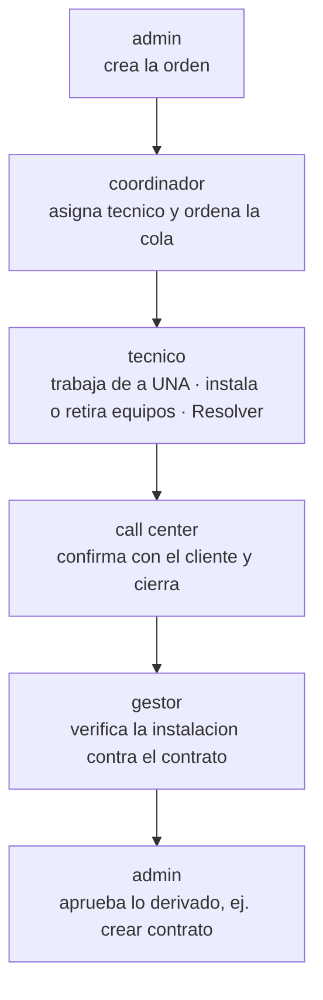
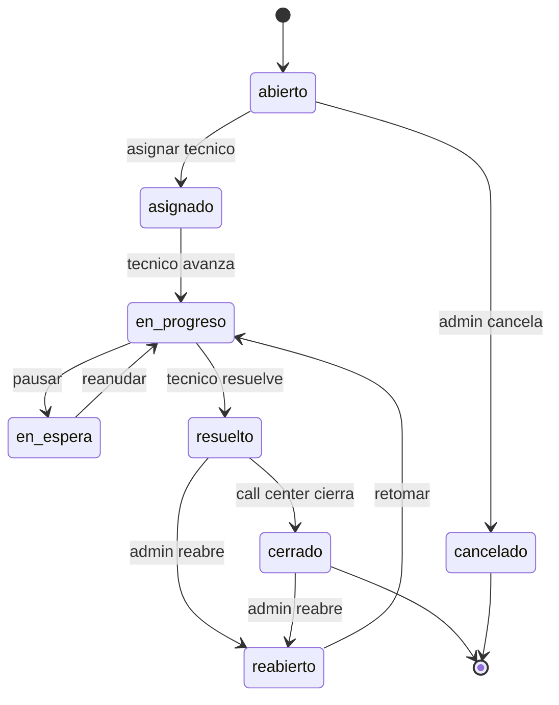
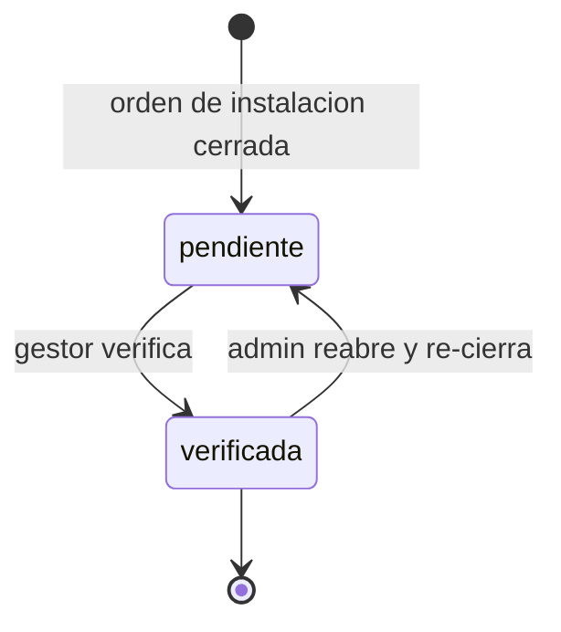
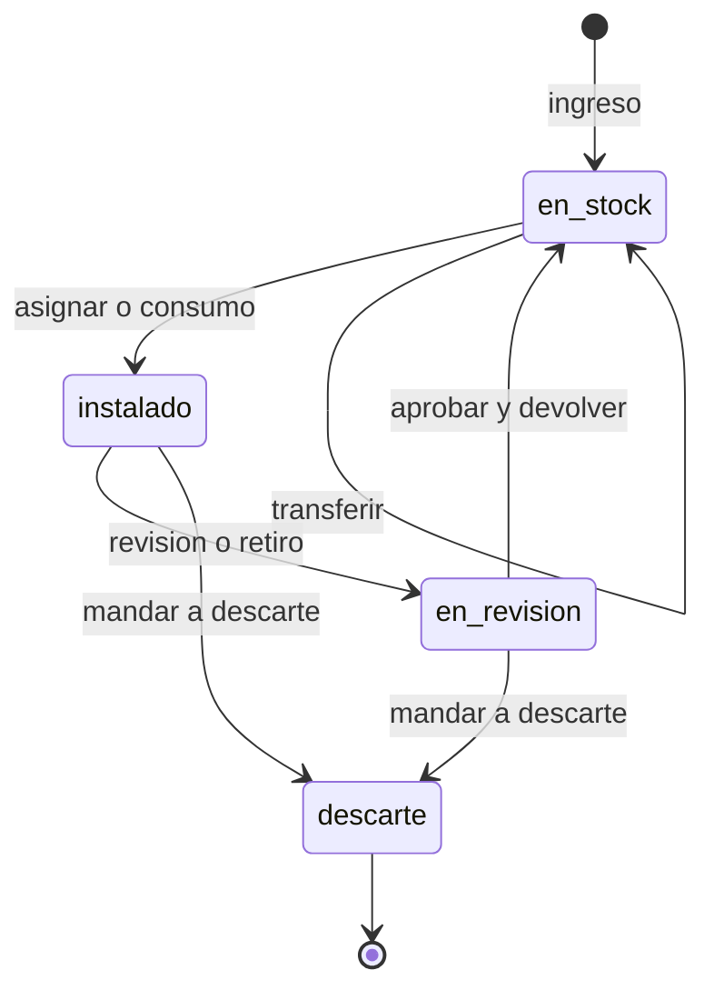

# Guía de testing — Tickets e Inventario (paquete del nuevo dueño)

> **Para quién es esto:** la persona que va a probar en el **Test Tenant** los cambios nuevos de
> **tickets/incidencias** e **inventario**, y avisar de bugs o mejoras.
>
> **Cómo usar la guía:** seguí las etapas **en orden**. Cada paso dice **qué hacer**, **qué deberías ver**
> y **si falla / anotá**. Cuando reportes algo, **citá la Etapa y el Paso** (ej.: *"Etapa 3, paso 4: al
> tocar Retirar no pasó nada"*) — así se ubica y arregla rápido. Al final hay una **plantilla de reporte**.
>
> **Los diagramas** de la sección 2 muestran el panorama; los podés mirar antes de empezar para entender
> "quién hace qué".

---

## 0. Antes de empezar (leer sí o sí)

1. **Versión correcta.** Confirmá en **login / perfil / sidebar** que estás en la versión que trae estos
   cambios. Si el equipo venía con una instalación vieja, cerrá la app, actualizá y volvé a abrir. Testear
   una versión vieja hace que un bug ya arreglado parezca nuevo.
2. **Regla de oro — identidad real, nunca "impersonando".** Todo este paquete se prueba entrando con el
   **usuario y contraseña reales de cada rol**. **NO** sirve entrar como super_admin ("Dev") y "ver como"
   el tenant: las acciones importantes (resolver, verificar, asignar, cerrar, retirar equipo, consumir
   material) están **bloqueadas a propósito** cuando impersonás. Si probás así, van a parecer rotas y no lo
   están.
3. **Todo pasa en el Test Tenant** (`Test Tenant`). No tocar Mairena ni Telenet.

---

## 1. Setup inicial (una sola vez)

Estado actual verificado del Test Tenant (para que sepas qué falta):

| Cosa | Estado |
|---|---|
| Módulos **Tickets** e **Inventario** | ✅ **Ya están encendidos** |
| Roles nuevos (`tecnico`, `coordinador`, `admin_tickets`, gestor) | ✅ Permitidos en la base |
| Usuarios con esos roles | ⚠️ **Faltan crear** (hoy solo hay admin, admin_cobranza, admin_usuarios y 2 cobradores) |
| Datos de inventario / tickets | Hay algo cargado; conviene preparar data limpia como abajo |

### Paso 1 — Verificar que los módulos están ON *(rol: super_admin "Dev")*
- **Qué hacer:** entrar como Dev → `/super/tenants` → tocar **Test Tenant** → pantalla de módulos → confirmar
  que **Inventario** y **Tickets** están en ON.
- **Qué deberías ver:** los dos switches encendidos. (Ya lo están; es solo verificar.)
- **Si falla:** si alguno está OFF, encendelo (esperá el toast "Módulo … habilitado").

### Paso 2 — Crear un usuario por cada rol *(rol: admin, identidad real)*
- **Qué hacer:** `/admin` → card **Cobradores / Personal** → **Invitar cobrador** → en el dropdown **Rol**
  vas a ver **Técnico**, **Admin de tickets** y **Coordinador técnico** (aparecen solo porque Tickets está ON).
  Creá uno de cada y **anotá la contraseña** que genera (no hay email; la contraseña se muestra al crear).
- **Usuarios mínimos a crear:**
  - **1 Técnico** (rol `tecnico`)
  - **1 Coordinador técnico** (rol `coordinador`)
  - **1 Admin de tickets** = el **call center** (rol `admin_tickets`)
  - **1 Admin de usuarios** = el **gestor que verifica** (rol `admin_usuarios`) — si no hay ya uno
  - El **admin** con el que ya entraste hace de "jefe que aprueba"
  - *(Opcional)* un 2º técnico para probar reasignación de cola.
- **Si falla:** si no aparecen esos roles en el dropdown, el módulo Tickets está OFF (volvé al Paso 1).

### Paso 3 — Cargar inventario *(rol: admin)*
- **Qué hacer:** `/admin` → card **Inventario** → **Catálogo** → creá: **1 categoría**, **1 producto
  serializado**, **1 producto a granel**, **1 proveedor**.
- **Ubicaciones (importante):** en Catálogo → Ubicaciones, creá al menos:
  - una tipo **Bodega**,
  - una tipo **Redes** (nueva; para material montado en planta),
  - una tipo **Técnico** asociada al **técnico de prueba** (sin esta, el técnico **no puede consumir**
    material).
- **Cargar equipos:** tab **Equipos** → botón **Ingreso** → producto serializado + ubicación bodega +
  número(s) de serie. Quedan **En stock** (verde). Cargá también algo de **granel** en la ubicación del técnico.
- **Qué deberías ver:** los seriales en la lista con chip **En stock**.

### Paso 4 — Cliente, contrato, tipo de orden y settings *(rol: admin)*
- **Qué hacer:** creá **1 cliente con contrato** (sirve para instalar/retirar equipos y para la verificación).
- **Crítico:** creá un **tipo de ticket con efecto = "instalación"** (pantalla de **Tipos de ticket**). Sin
  un tipo de instalación, la **verificación del gestor (Etapa 5) NUNCA se dispara**.
- **Settings de cierre** (en la pantalla de Tipos de ticket / configuración de tickets):
  - `Intentos mínimos` → **3** (default)
  - `Días mínimos` → viene en **2**; el dueño habló de **5**. **Para poder probar rápido** el "cerrar sin
    confirmar" sin esperar días, ponelo temporalmente en **0** y después restauralo.
  - `Auto-cierre (días)` → **0 = apagado** por default. El auto-cierre real es a 15 días vía tarea de
    madrugada; es difícil de probar a mano (ver Etapa 4, paso 5).

---

## 2. Cómo funciona (el panorama)

### 2.1 Los roles — quién es quién

| Rol en la app | En la vida real | Qué hace en este paquete |
|---|---|---|
| **admin** | El jefe del ISP | Crea órdenes, **aprueba**, reabre. Ve y edita todo. |
| **coordinador** | Coordinador de técnicos | **Solo** reparte y ordena la cola. **No** toca el trabajo. |
| **tecnico** | El que va al campo | Trabaja **una orden a la vez**, instala/retira equipos, **resuelve**. |
| **admin_tickets** | **Call center** | Recibe la orden resuelta y **confirma con el cliente para cerrar**. |
| **admin_usuarios** | **Gestor** | **Verifica** que lo instalado coincida con el contrato. |
| **super_admin** | Dueño del SaaS ("Dev") | Enciende módulos. **No se usa** para probar acciones. |

### 2.2 El recorrido completo entre roles



> El técnico **libera su cola con `resuelto`** (que él controla) y sigue con la próxima orden **sin esperar**
> a que el call center ubique al cliente. Así un cliente que no contesta no le paraliza el día.

### 2.3 Ciclo de vida de la ORDEN / TICKET



**Tres formas de cerrar** (todas dejan la orden en `cerrado`):
1. **Confirmado, cerrar** — el call center habló con el cliente.
2. **Cerrar sin confirmar** — habilitado tras **≥3 intentos de contacto** y **≥N días**; pide **motivo obligatorio**.
3. **Auto-cierre** — una tarea automática de madrugada cierra las que llevan **≥15 días** resueltas (si está configurado).

**La "cola" del técnico:** las órdenes en `abierto/asignado/en_progreso/reabierto` **ocupan** la cola (bloquean).
`resuelto`, `en_espera`, `cancelado` y `cerrado` la **liberan**. Por eso el técnico avanza aunque el call
center todavía no cierre.

### 2.4 Verificación de la instalación (estado paralelo del gestor)

Aplica **solo a órdenes de tipo "instalación"**.



### 2.5 Ciclo de vida del EQUIPO en inventario



> **Clave de Fase 1:** cuando un equipo entra a **En revisión**, **todavía NO cuenta como stock** (está en
> "limbo"). Recién suma a la bodega cuando alguien toca **Aprobar y devolver**. "Descarte" es el nombre nuevo
> del estado interno `baja` (en la base vas a ver `baja`; **no es un bug**).

---

## 3. Paso a paso end-to-end (el recorrido de prueba)

> Hacé esto de corrido, cambiando de usuario en cada etapa. Es **un solo caso** que recorre todo el lifecycle.

### Etapa 0 — Dejar un equipo listo en stock *(rol: admin)*
1. **Qué hacer:** `/admin/inventario` → tab **Equipos** → **Ingreso** → producto serializado + bodega + un serial.
   **Qué deberías ver:** el serial con chip **En stock** (verde). **Si falla / anotá:** si no ves el botón
   **Ingreso**, entraste con un rol sin permiso (ej. admin_cobranza tiene inventario bloqueado).

### Etapa 1 — Crear la orden *(rol: admin)*
1. **Qué hacer:** `/admin/tickets` → **Nuevo ticket** → elegí el **tipo "instalación"** + el cliente/contrato.
   **Qué deberías ver:** la orden en la lista en estado **abierto**. **Si falla / anotá:** si no ves "Nuevo
   ticket", revisá que el módulo Tickets esté ON y que seas admin.

### Etapa 2 — El coordinador asigna y ordena la cola *(rol: coordinador, login real)*
1. **Qué hacer:** entrá como coordinador → caés en la pestaña **Tickets** (abajo: Tickets · Mapa · Perfil).
   Abrí la orden. **Qué deberías ver:** en el detalle **solo dos botones**: **Asignar técnico** y **Poner en
   la cola / Posición N**. **NO** debe ver comentar, checklist, editar materiales, retirar, ni cambiar estado.
   **Si falla / anotá:** si ve más botones (ej. puede editar el trabajo), es un bug importante.
2. **Qué hacer:** **Asignar técnico** → elegí el técnico de prueba. **Qué deberías ver:** el nombre del técnico
   en el encabezado; la orden pasa a **asignado**.
3. **Qué hacer:** **Poner en la cola** → diálogo *"¿Dónde va en la cola?"* con **Primera / En la posición N /
   Última**. **Qué deberías ver:** snackbar **"Cola actualizada"** y la cola renumerada. **Si falla / anotá:**
   si la orden no tiene técnico, sale *"Primero asignale un técnico"*. Si el coordinador logra editar algo que
   no sea asignar/ordenar, al sincronizar debería salir un aviso de rechazo *"El coordinador solo puede asignar
   y ordenar…"* (puede llegar unos segundos después).
4. **Anotá:** creá 3+ órdenes para el mismo técnico y reordenalas; en la Etapa 3 mirá que al técnico le cambie
   cuál queda "activa".

### Etapa 3 — El técnico trabaja la orden *(rol: tecnico, login real)*
1. **Qué hacer:** entrá como técnico → **Mis tickets** (chips **Activos / Cerrados**). **Qué deberías ver:** en
   Activos, la **primera** orden es la **activa** (se abre); las de abajo salen con **candado 🔒** y el texto
   *"Se habilita al resolver la orden de arriba"* y **no se pueden abrir**.
2. **Qué hacer:** tocá la orden activa → detalle "solo botones". **Qué deberías ver:** botones **Avanzar / En
   espera / Resolver** y **Marcar ubicación** (GPS). **No** tiene cerrar/cancelar/reasignar.
3. **Consumir material (instalar un equipo):** **Materiales → Agregar** → elegí ubicación (su custodia), tipo
   Serializado o Granel → **Registrar**. **Qué deberías ver:** aviso *"El stock se descuenta al sincronizar"*.
   Al sincronizar, el serial pasa **En stock → Instalado** en el cliente. **Si falla / anotá:** si dice que no
   tiene custodia, faltó crearle la **ubicación tipo Técnico** (Setup Paso 3).
4. **Retirar un equipo del cliente:** aparece **Equipos del cliente → Retirar** solo si el cliente ya tiene un
   equipo instalado. Tocá **Retirar** → confirmá. **Qué deberías ver:** aviso *"Equipo retirado. Pasa a
   revisión al sincronizar."*; el equipo **desaparece de la lista al toque**. Al sincronizar, ese serial pasa
   **Instalado → En revisión**. **Si falla / anotá:** si al sincronizar el inventario no se movió, avisá con el
   número de serie.
5. **Qué hacer:** botón **Resolver**. **Qué deberías ver:** la orden pasa a **resuelto** y la **cola se libera**
   (la siguiente orden pierde el candado).

### Etapa 4 — El call center cierra la orden *(rol: admin_tickets, login real)*
1. **Qué hacer:** `/admin/tickets` → abrí la orden **resuelto**. **Qué deberías ver:** un panel **"Confirmar con
   el cliente"** y un contador **"Intentos de contacto (n)"**.
2. **Qué hacer:** **Registrar intento** → elegí un motivo (No contesta / Buzón / Número equivocado / Pidió que
   lo llamen). **Qué deberías ver:** snackbar "Intento registrado" y el contador sube. Registrá **3 intentos**.
3. **Cierre normal:** **Confirmado, cerrar** → confirmá. **Qué deberías ver:** la orden pasa a **cerrado**.
4. **Cierre sin confirmar:** con **≥3 intentos** y **≥N días** (por eso en el setup conviene poner Días=0 para
   probar), aparece **Cerrar sin confirmar** → pide **motivo obligatorio** (el botón no cierra si está vacío) →
   **Qué deberías ver:** "Orden cerrada sin confirmar". **Si no aparece el botón:** el texto dice qué falta
   ("faltan X intentos" / "faltan X días").
5. **Auto-cierre (informativo):** con Auto-cierre=15, una tarea de madrugada cierra las órdenes resueltas de
   ≥15 días. Es difícil de probar a mano (hay que esperar). **Anotá como observación:** una orden auto-cerrada
   **igual cae en "Por verificar"**, pero **no** muestra la alerta "sin confirmación" aunque nadie confirmó —
   es así a propósito, pero avisá si te parece confuso.

### Etapa 5 — El gestor verifica la instalación *(rol: admin_usuarios, login real)*
1. **Qué hacer:** entrá como gestor → **Solicitudes** → pestaña **"Por verificar"**. **Qué deberías ver:** un
   card por cada instalación cerrada, con **Cliente / Teléfono / Contrato**. Si la orden se cerró sin confirmar,
   muestra una alerta; si no hay contrato, una alerta roja.
2. **Qué hacer:** botón **Verificada** (si no hay contrato, avisa pero deja verificar igual). **Qué deberías
   ver:** el card sale de la bandeja; en el detalle del ticket la fila **"Verificación"** pasa a *"verificada por
   X · fecha"*. **Si falla / anotá:** si tocás Verificada y al sincronizar "se deshace", avisá (es un tema de
   permisos del servidor).

### Etapa 6 — El admin aprueba lo derivado *(rol: admin)*
1. **Qué hacer:** si el gestor necesitó, por ejemplo, **crear un contrato faltante**, esa acción cae en
   **Solicitudes → Pendientes**. Entrá como admin → **aprobar / rechazar**. **Qué deberías ver:** la solicitud
   procesada. **Nota:** la verificación en sí no genera una solicitud; lo que pasa por esta cola es el trabajo
   derivado (crear contrato, etc.).

### Etapa 7 — Reabrir y re-verificar *(rol: admin → gestor)*
1. **Qué hacer:** con la orden **verificada**, entrá como **admin** y **Reabrí** la orden → que el técnico
   cambie algo → que se **re-cierre**. **Qué deberías ver:** la orden **vuelve a aparecer** en "Por verificar"
   del gestor, con la verificación anterior **borrada** (hay que verificar de nuevo). **Si falla / anotá:** si
   sigue mostrando la verificación vieja, avisá.

---

## 4. Ciclo de inventario aparte (revisión → devolver o descartar)

> Esto se puede probar sin un ticket, directo desde Inventario, con el admin. Es el corazón de la Fase 1.

1. **Instalar (preparar):** un serial **En stock** → ficha del equipo → **Asignar a cliente** → queda **Instalado**.
2. **Mandar a revisión:** en la ficha del equipo Instalado → **Mandar a revisión** → confirmá. **Qué deberías
   ver:** chip **En revisión** (violeta), se limpia el cliente. **Importante:** la bodega **NO sube +1** todavía.
3. **Dos caminos desde "En revisión":**
   - **Aprobar y devolver** → elegí ubicación destino (bodega **o Redes**) → vuelve a **En stock** y **recién
     ahí** suma +1 a esa ubicación.
   - **Mandar a descarte** → elegí estado (Dañado / Retirado / **Descarte definitivo**) + motivo → queda
     **Descarte** (rojo), **terminal** (ya no se puede reactivar).
4. **Filtro:** en tab Equipos, el chip **Estado** ahora incluye **En revisión** y **Descarte** (para ver la cola
   pendiente de revisar).

---

## 5. Checklist de edge cases (cosas para intentar romper)

**Inventario / revisión**
- [ ] Mandar el **mismo serial** a revisión desde **dos pantallas** → el 2º debe avisar "El equipo cambió de estado". Que **no** quede un movimiento fantasma.
- [ ] Instalado → revisión → descarte: confirmá que la bodega **nunca subió +1 en revisión** (solo en "Aprobar y devolver").
- [ ] **Aprobar a Redes:** devolver un equipo a la ubicación tipo Redes y ver que cuenta como stock ahí (tab Existencias).
- [ ] Intentar reactivar un serial en **Descarte** → no debe haber botones y el server lo rechaza.
- [ ] Confirmá que en la base/historial "descarte" aparece como `baja` — **no es bug**.

**Cola del técnico**
- [ ] El coordinador **reordena** la cola → al técnico se le mueve el candado / cuál es la activa.
- [ ] Poner la orden activa en **En espera** → podés abrir otra, pero la cola sigue apuntando a la más vieja viva.
- [ ] *Límite conocido:* dos equipos offline sin sincronizar podrían resolver fuera de orden — igual que en cobranza.

**Retiro / consumo**
- [ ] **Ticket sin cliente** (corte masivo): el retiro no hace nada; materiales solo permite **granel**.
- [ ] **Retirar dos veces** el mismo equipo → el 2º no hace nada (no es error); el equipo no reaparece en otra orden del mismo cliente.

**Cierre / verificación**
- [ ] **Motivo vacío** en "cerrar sin confirmar" → el botón no cierra el diálogo.
- [ ] **Instalación sin contrato:** "Verificada" avisa pero deja verificar → que quede visible para el admin.
- [ ] *Observación by-design:* la orden **auto-cerrada** cae en "Por verificar" pero **sin** la alerta "sin confirmación".

**Roles / gating**
- [ ] **Coordinador** intenta editar el trabajo → imposible por pantalla; si se fuerza, el server rechaza.
- [ ] **Gestor** intenta hacer más que "Verificada" → el server rechaza.
- [ ] Apagar el módulo **Tickets** con un call center/coordinador logueado → debe rebotar y ocultar los cards.
- [ ] **admin_cobranza** entrando por URL a `/admin/tickets` o `/admin/inventario` → rebota a `/admin` (bloqueado).
- [ ] *Límite transversal:* coordinador/técnico/gestor a veces ven botones que el server **rechaza recién al
      sincronizar** (el aviso llega unos segundos después, no al instante). Anotá si te resulta confuso.

---

## 6. Cómo reportar un bug o mejora

Para cada cosa que encuentres, copiá esta plantilla:

```
- Etapa / Paso: (ej. "Etapa 3, paso 4")
- Rol con el que estaba: (ej. tecnico)
- Qué hice:
- Qué esperaba ver:
- Qué vi en realidad:
- ¿Es bug o mejora?:
- Nº de serie / cliente / orden (si aplica):
- Captura (si podés):
```

---

## 7. Glosario

**Estados de la orden:** **abierto** (sin técnico) · **asignado** (tiene técnico) · **en progreso** (trabajando)
· **en espera** (pausada, falta repuesto — no bloquea la cola) · **resuelto** (el técnico terminó; libera su cola)
· **cerrado** (el call center confirmó, o cierre sin confirmar, o auto-cierre) · **reabierto** (el admin la volvió
a abrir) · **cancelado**.

**Verificación:** **pendiente** (esperando al gestor) · **verificada** (el gestor firmó que lo instalado coincide
con el contrato). Solo para órdenes de **instalación**.

**Estados del equipo:** **En stock** (en bodega) · **Instalado** (en un cliente) · **En revisión** (volvió del
campo, en limbo, aún no cuenta como stock) · **Dañado / Retirado** (pasos intermedios) · **Descarte** (fuera de
circulación, definitivo; en la base es `baja`).

**Redes:** ubicación para material montado en planta (troncales, splitters), que no está en bodega ni con un cliente.
