# Guía de uso — CRM

> **Para quién es esta guía:** el personal del ISP — administradores, admin de
> cobranza, admin de usuarios y cobradores. Explica **cómo se usa cada módulo
> de la app**, con el paso a paso ilustrado de cada acción y qué pasa por
> detrás.
> No cubre el panel del dueño del sistema (super admin).

**Datos de ejemplo usados en toda la guía:** la clienta **María Peña Ruíz**
(código `CL0102`, comunidad La Barrera), el cobrador **Juan López** (prefijo
`JL`), el plan **Básico 10 Mbps** de C$ 450/mes, contrato `CT0088` instalado
el 15 (su día de pago).

**Roles que vas a ver en cada flujo:**

| Rol | Qué es |
|---|---|
| **admin** | Administrador del ISP: ve y hace todo en su empresa |
| **admin de cobranza** | Igual que admin para clientes/contratos/cobros; sin acceso a configuración, planes ni personal |
| **admin de usuarios** | Gestiona clientes y contratos SIN tocar plata: suspender, cancelar o reactivar un servicio no lo ejecuta — lo **solicita** y lo aprueba un admin |
| **cobrador** | El de campo: cobra, registra visitas, ve su ruta — funciona sin internet |

> 💡 Si un botón de esta guía no aparece en tu app, casi siempre es porque tu
> rol no lo permite o porque esa función está apagada para tu empresa (la
> activa el dueño del sistema). Cada flujo indica **quién puede**.

---

## Búsqueda rápida — «¿cómo hago…?»

| Necesito… | Andá a |
|---|---|
| Dar de alta un cliente | [Crear un cliente nuevo](#crear-un-cliente-nuevo) |
| Corregir datos o dar de baja un cliente | [Editar la ficha o desactivar](#editar-la-ficha-o-desactivar-un-cliente) |
| Cambiarle el cobrador a un cliente (o a varios) | [Asignar o cambiar el cobrador](#asignar-o-cambiar-el-cobrador-de-un-cliente) |
| Crear un contrato | [Crear un contrato](#crear-un-contrato-genera-las-cuotas-solo) |
| Cambiar el día de pago de un cliente | [Cambiar el día de pago](#cambiar-el-día-de-pago-cobra-el-puente) |
| Subirle o bajarle el plan a un cliente | [Cambiar el plan](#cambiar-el-plan-de-un-contrato-vigente) |
| Suspender / reactivar / cancelar un servicio | [Suspender](#suspender-un-contrato) · [Reactivar](#reactivar-un-contrato-suspendido) · [Cancelar](#cancelar-un-contrato-definitivo) |
| Pedir que un admin apruebe una suspensión o cancelación | [Solicitudes](#pedir-aprobación-suspender-cancelar-o-reactivar-admin-de-usuarios) |
| Cobrar una cuota | [Cobrar una cuota](#cobrar-una-cuota-el-flujo-del-día-a-día) |
| **Anular un cobro hecho por error y volver a cobrarlo** | [Anular y re-cobrar](#anular-una-cuota-cobrada-por-error-y-volver-a-cobrarla) |
| Cobrar la deuda de un suspendido o cancelado | [Fuera de ruta](#cobrar-deuda-de-contratos-suspendidos-o-cancelados-fuera-de-ruta) |
| Cobrar en dólares | [Cobrar en USD](#cobrar-en-dólares-usd) |
| Reimprimir un recibo | [El recibo](#el-recibo-imprimir-pdf-y-reimprimir) |
| El recibo sale cortado, sin el pie o con símbolos raros | [Impresora de la PC](#configurar-la-impresora-de-la-computadora-usb) |
| Cobrarle una multa o cargo suelto a un cliente | Función «Cobro extra» — debe estar habilitada para tu empresa |
| Hacerle un descuento a una cuota | [Aplicar un descuento](#aplicar-un-descuento-a-una-cuota-y-quitarlo) |
| El cliente pagó de más — ¿y ahora? | [Saldo a favor](#el-cliente-pagó-de-más-decidir-qué-hacer-con-el-excedente) |
| Saber quién cambió algo y cuándo | Historial: el ícono del reloj en cada pantalla ([ejemplo](#acciones-rápidas-fotos-e-historial-del-cliente)) |
| Dar de alta un cobrador o empleado nuevo | [Invitar a un miembro](#invitar-a-un-miembro-nuevo-cobrador-admin-técnico) |
| Un empleado olvidó su contraseña | [Forzar contraseña](#editar-un-miembro-forzarle-contraseña-o-desactivarlo) |
| Registrar que visité y no estaba / prometió pagar | [Registrar una visita](#registrar-una-visita-sin-cobro) |
| Planificar la ruta del día | [El mapa](#planificar-el-día-con-el-mapa) |
| Agregar una comunidad / barrio nuevo | [Geografía](#armar-el-catálogo-geográfico-departamento--municipio--comunidad) |
| Crear un plan o subirle el precio | [Planes](#planes-de-servicio-crear-editar-precio-y-desactivar) |
| Ver qué tengo que atender hoy | [Centro de cobranza](#el-centro-de-cobranza-qué-atiendo-hoy) |
| Mandar recordatorios de pago por WhatsApp | [Avisos](#avisar-por-whatsapp-a-los-clientes-en-gracia-o-mora) |
| Descargar el reporte del mes / cuadrar caja | [Generar un reporte](#generar-y-descargar-un-reporte) · [Arqueo](#cuadrar-la-caja-con-el-arqueo) |
| Saber dónde está (y estuvo) un equipo | [La ficha del equipo](#la-ficha-del-equipo-su-vida-completa-y-la-baja) |
| Cortar el servicio a un moroso | [Orden de corte](#órdenes-de-corte-de-la-mora-al-corte-físico-y-la-suspensión) |
| Armar la red (nodo → hub → puerto) | [Red](#armar-la-topología-de-red-y-conectar-a-los-clientes) |
| Cambiar la tasa del dólar | [Configuración → Pagos](#configuración--pagos-métodos-y-dólar) |
| Cambiar el texto del recibo o del aviso de WhatsApp | [Recibos](#configuración--recibos-el-diseñador-del-comprobante) · [Cobranza](#configuración--cobranza-reglas-y-permisos) |
| Cambiar los días de gracia antes de la mora | [Configuración → Cobranza](#configuración--cobranza-reglas-y-permisos) |

---

## Índice por módulo

**Etapa 1 — Núcleo de dinero (este documento):**
1. [Clientes](#módulo-clientes)
2. [Contratos](#módulo-contratos)
3. [Cuotas y cobros — «Por cobrar»](#módulo-cuotas-y-cobros-por-cobrar)
4. [Pagos y recibos](#módulo-pagos-y-recibos)
5. [Mora](#módulo-mora)
6. [Cargos y descuentos](#módulo-cargos-y-descuentos)
7. [Saldo a favor (crédito)](#módulo-saldo-a-favor-crédito)

**Etapa 2 — Campo y operación:**
8. [Personal (cobradores y roles)](#módulo-personal-cobradores-y-roles)
9. [Visitas](#módulo-visitas)
10. [Mapa y rutas](#módulo-mapa-y-rutas)
11. [Geografía](#módulo-geografía)
12. [Planes](#módulo-planes)
13. [Centro de cobranza](#módulo-centro-de-cobranza)
14. [Avisos y WhatsApp](#módulo-avisos-y-whatsapp)
15. [Reportes, arqueo y dashboard](#módulo-reportes-arqueo-y-dashboard)

**Etapa 3 — Módulos opcionales y configuración:**
16. [Red (nodo → hub → puerto)](#módulo-red-nodo--hub--puerto)
17. [Configuración](#módulo-configuración)

---

# Módulo: Clientes

**Qué es:** el padrón de abonados. Todo arranca acá: sin cliente no hay
contrato ni cobro. Cada cliente tiene su ficha (datos, ubicación, cobrador,
etiquetas) y su detalle con pestañas: **Detalle · Contratos · Equipos · Visitas**.

**Qué se puede hacer:**

| Acción | Quién | Dónde |
|---|---|---|
| Crear / editar / desactivar | admin, admin de cobranza | Clientes → `+ Nuevo` / lápiz |
| Asignar cobrador (uno o masivo) | admin, admin de cobranza | Detalle → tarjeta Cobrador · Lista → selección múltiple |
| Etiquetar | admin, admin de cobranza | Detalle → Etiquetas → Asignar |
| Crear el catálogo de etiquetas | solo admin | Administración → Etiquetas |
| Fotos, llamar/WhatsApp/navegar | todos | Detalle del cliente |
| Ver historial de cambios | admin, admin de cobranza | Detalle → ícono reloj |
| Buscar y cobrar | todos (el cobrador ve la ficha en solo-lectura) | Lista / Por cobrar |

### Crear un cliente nuevo

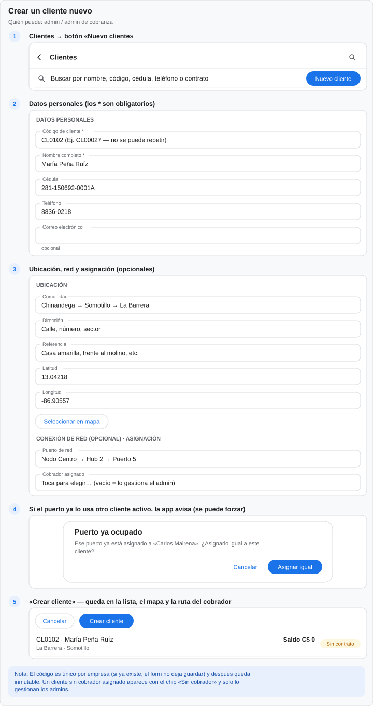

En la pantalla **Clientes** el botón azul «Nuevo cliente» abre el formulario. Solo el código y el nombre son obligatorios; la comunidad sale del catálogo de Geografía, el puerto de la topología de Red y el cobrador de tu Personal. Al guardar, la app valida que el código no se repita en tu empresa y — si elegiste un puerto ocupado por otro cliente activo — te pide confirmarlo. El cliente queda al instante en la lista, en el mapa (cuando le cargues GPS) y en la ruta del cobrador asignado.

### Editar la ficha o desactivar un cliente

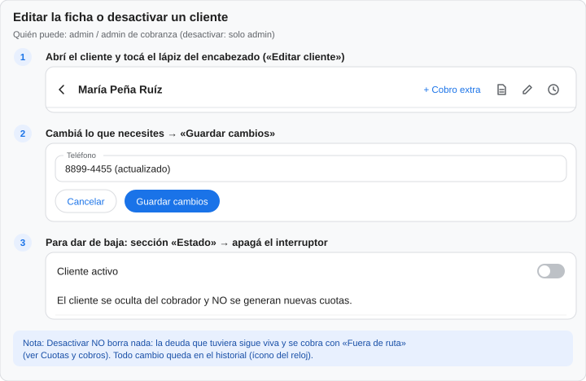

El lápiz del encabezado abre el mismo formulario del alta con los datos cargados. El interruptor «Cliente activo» (solo lo ve el rol admin) es la baja suave: al apagarlo, el cliente desaparece de las listas, el mapa y la ruta, y no se le generan cuotas nuevas — pero nada se borra: sus contratos, pagos y deuda siguen en el sistema, y la deuda se puede seguir cobrando con el chip «Fuera de ruta».

### Asignar o cambiar el cobrador de un cliente

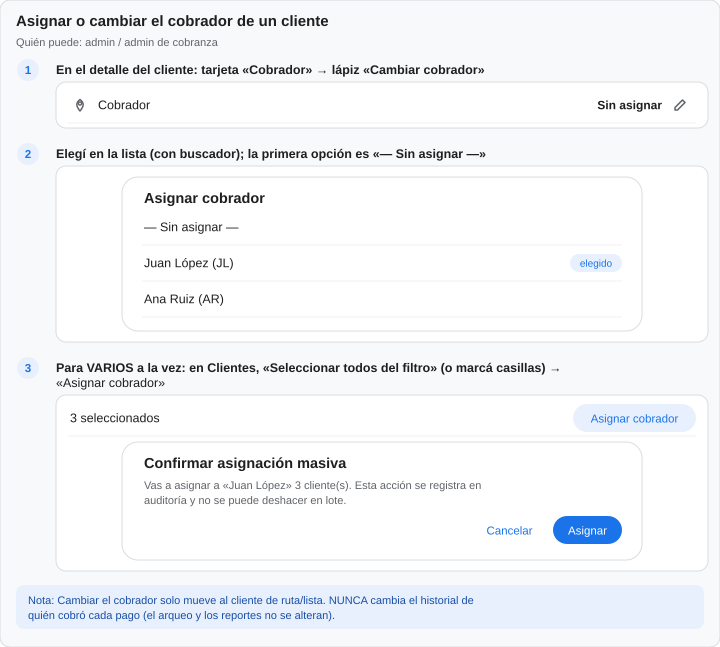

La tarjeta verde «Cobrador» del detalle muestra quién tiene al cliente en su ruta; el lápiz abre el selector con buscador (la primera opción «— Sin asignar —» lo deja administrado por el admin). Para reasignar en masa, en la lista de Clientes marcá las casillas (o «Seleccionar todos del filtro») y usá «Asignar cobrador»: la app te muestra cuántos vas a mover y pide confirmación porque el lote no se deshace de un golpe.

### Etiquetas: crear el catálogo y etiquetar clientes

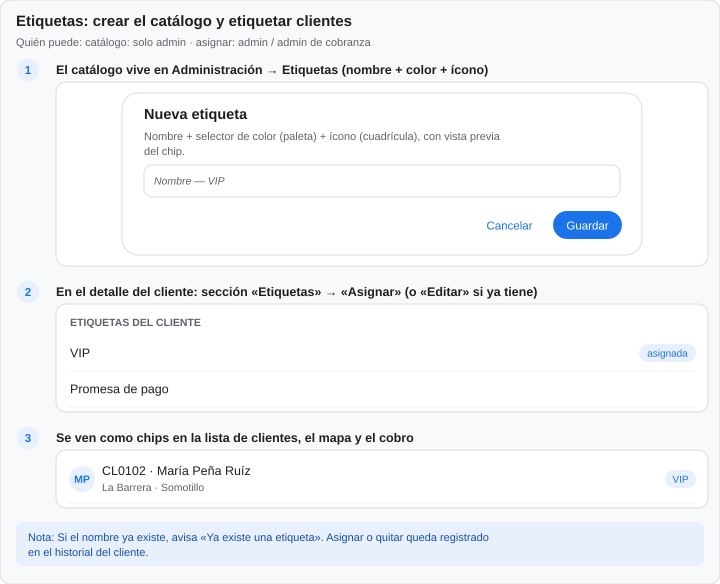

Las etiquetas clasifican clientes a tu gusto (VIP, moroso crónico, promesa de pago…). El catálogo — nombre, color e ícono — es exclusivo del admin en Administración → Etiquetas; asignarlas o quitarlas se hace desde la sección «Etiquetas» del detalle de cada cliente y lo puede hacer también el admin de cobranza. Una vez asignadas, los chips de color acompañan al cliente en la lista, en el pin del mapa y en la pantalla de cobro.

### Acciones rápidas, fotos e historial del cliente

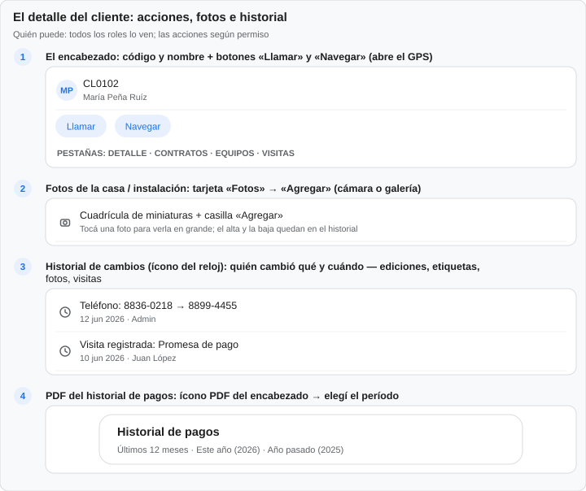

El encabezado del cliente concentra las acciones rápidas: «Llamar» marca su teléfono y «Navegar» abre la navegación a su GPS. En la barra superior están el cobro extra (si tu empresa lo tiene habilitado), el PDF del historial de pagos (elegís el período), el lápiz de editar y el reloj del historial de cambios — ahí queda registrado quién cambió qué y cuándo: ediciones de la ficha, etiquetas, fotos y visitas.

**Preguntas frecuentes:**
- **¿El cobrador solo ve “sus” clientes?** No — ve y puede cobrar a TODOS los
  clientes de la empresa. El cobrador asignado solo define en qué ruta/lista
  aparece el cliente por defecto.
- **¿Qué pasa si dos clientes quedan en el mismo puerto de red?** La app avisa
  al guardar («ya está asignado a X»); se puede forzar si es intencional.
- **¿Puedo cambiar el código de un cliente?** No — una vez asignado es
  inmutable. Si hubo un error de tipeo, pedile la corrección al dueño del
  sistema.

---

# Módulo: Contratos

**Qué es:** el acuerdo de servicio — define plan, precio, día de pago y
duración (fija de N meses o indefinida). **Al crearse, las cuotas se generan
solas.** De acá cuelga toda la plata del cliente.

**Qué se puede hacer:**

| Acción | Quién | Dónde |
|---|---|---|
| Crear contrato | admin, admin de cobranza | Cliente → pestaña Contratos → `+ Nuevo` |
| Cambiar fecha de pago | admin, admin de cobranza (cobrador solo si está habilitado) | Detalle del contrato |
| Cambiar plan | admin, admin de cobranza (si está habilitado) | Detalle del contrato |
| Suspender / Reactivar / Cancelar | admin, admin de cobranza | Detalle del contrato |
| Solicitar suspender / cancelar / reactivar | admin de usuarios | Detalle del contrato → «Solicitar…» |
| Aprobar o rechazar esas solicitudes | solo admin | Solicitudes → Pendientes |
| Cargos, descuentos y crédito | admin, admin de cobranza | Detalle → cuotas ([ver módulo](#módulo-cargos-y-descuentos)) |
| Adjuntar documento (PDF/Word) | admin, admin de cobranza | Detalle → pestaña Documento |
| Ver historial del contrato | admin, admin de cobranza | Detalle → ícono reloj |

### Crear un contrato (genera las cuotas solo)

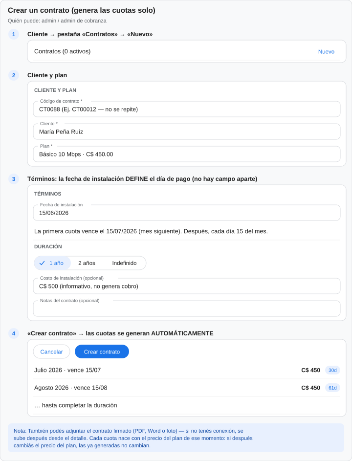

Desde la pestaña Contratos del cliente, «Nuevo» abre el formulario. Elegís el plan del catálogo (el precio viene de ahí) y la **fecha de instalación** — ese día del mes queda como su día de pago: la primera cuota vence el mismo día del mes siguiente. Al tocar «Crear contrato», el sistema genera solo TODAS las cuotas del período (12, 24, o un colchón de 3 meses si es indefinido), cada una con el precio del plan de ese momento.

### Leer la tarjeta del contrato

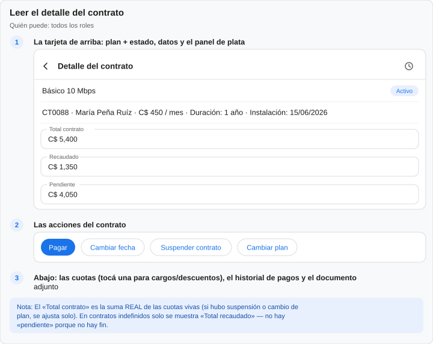

La tarjeta superior resume el contrato: plan y estado (Activo/Suspendido/Cancelado/Completado), código, cliente, precio mensual y duración, y el panel de plata: **Total contrato = Recaudado + Pendiente**, calculado siempre desde las cuotas reales. Debajo están las acciones («Pagar», «Cambiar fecha», «Suspender contrato», «Cambiar plan») y, más abajo, las cuotas una por una, el historial de pagos y el documento adjunto.

### Cambiar el día de pago (cobra el puente)

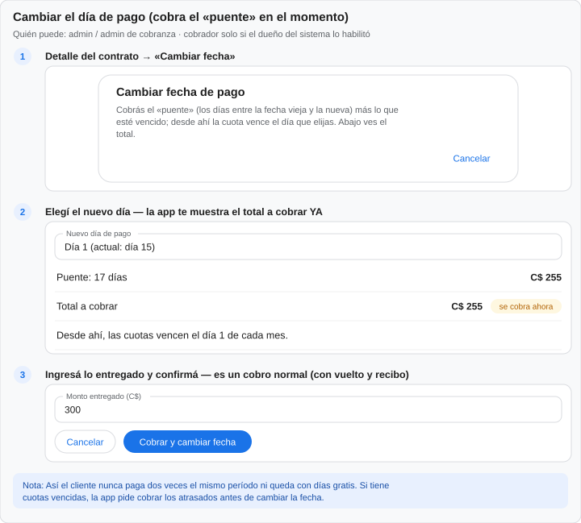

Cambiar el día de pago no es solo mover una fecha: los días entre el ciclo viejo y el nuevo (el «puente») se cobran prorrateados en el momento, en el mismo diálogo — con vuelto y recibo como cualquier cobro. La app te muestra el total antes de confirmar y, desde ahí, todas las cuotas futuras vencen el día nuevo. Si el cliente tiene cuotas vencidas, primero hay que ponerlas al día.

### Cambiar el plan de un contrato vigente

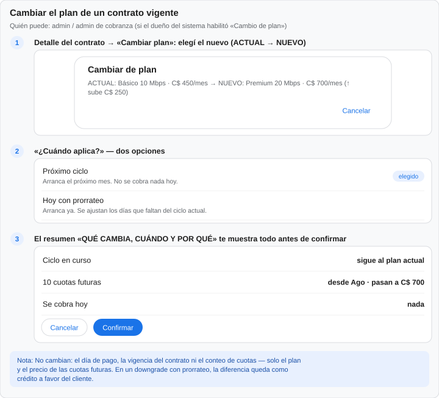

Sube o baja el plan sin cancelar el contrato (conserva antigüedad, día de pago y vigencia). El diálogo muestra el ACTUAL → NUEVO con la diferencia de precio y te deja elegir cuándo aplica: al próximo ciclo (no se cobra nada hoy) o desde hoy prorrateado (se ajustan los días que faltan del mes — en un upgrade se cobran, en un downgrade quedan como crédito a favor). El resumen «Qué cambia, cuándo y por qué» lo detalla antes de confirmar.

### Suspender un contrato

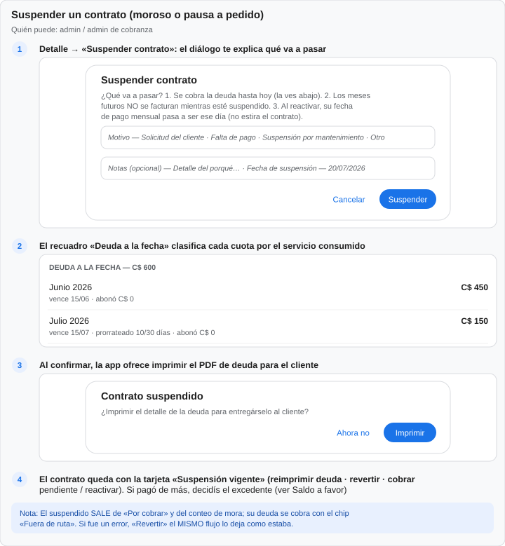

Suspender congela el contrato del moroso (o del que pide pausa) SIN perder la deuda: la app clasifica cada cuota por el servicio realmente consumido — los meses cumplidos se deben enteros, el mes en curso se prorratea por días y los futuros se anulan (no se facturan más). Esa «Deuda a la fecha» queda congelada, imprimible en PDF para entregarle al cliente, y cobrable con «Fuera de ruta». Si el cliente había pagado meses por adelantado, la app te hace decidir el destino del excedente.

### Reactivar un contrato suspendido

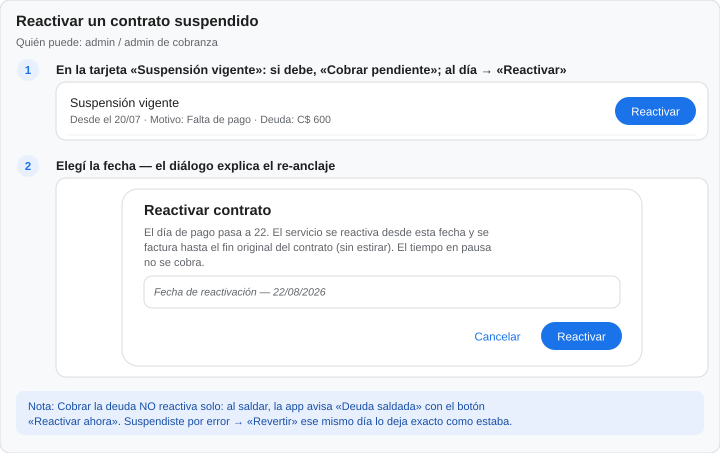

Cuando el cliente vuelve, la tarjeta «Suspensión vigente» ofrece «Cobrar pendiente» (si aún debe) y «Reactivar». Al reactivar, el día de la reactivación pasa a ser su nuevo día de pago y la facturación arranca desde ahí — el tiempo suspendido no se cobra ni estira el contrato. Ojo: saldar la deuda NO reactiva automáticamente; la app avisa «Deuda saldada» y la reactivación la confirma el admin.

### Cancelar un contrato (definitivo)

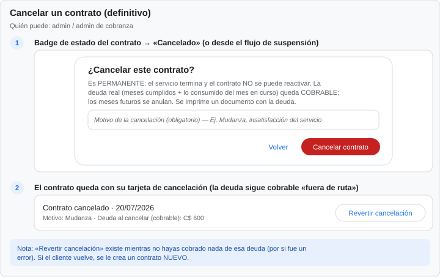

Cancelar es el final definitivo: el diálogo lo advierte en mayúsculas y exige el motivo. Igual que la suspensión, cobra lo consumido y anula lo futuro, dejando la deuda real cobrable «fuera de ruta» — pero sin vuelta atrás (salvo «Revertir cancelación», disponible solo mientras no hayas cobrado nada de esa deuda, para los errores). Si el cliente regresa algún día, se le hace un contrato nuevo.

### Pedir aprobación: suspender, cancelar o reactivar (admin de usuarios)

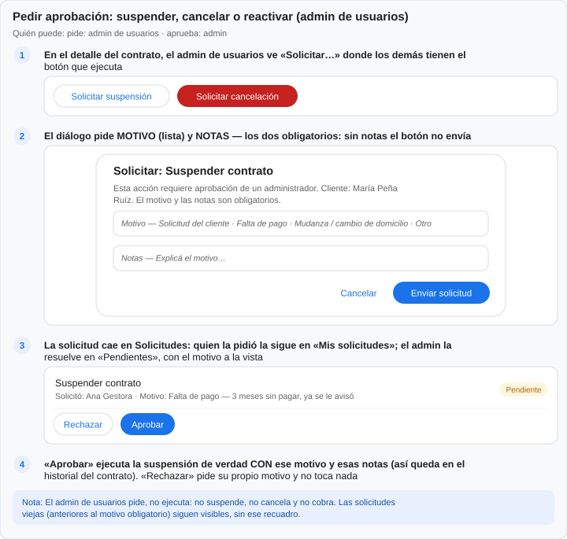

El **admin de usuarios** gestiona los contratos pero no ejecuta los cambios de servicio: donde los demás ven «Suspender contrato» o «Reactivar», él ve **«Solicitar suspensión»**, **«Solicitar cancelación»** y **«Solicitar reactivación»**. Al tocarlos, la app pide dos cosas y **las dos son obligatorias**: el **Motivo** (Solicitud del cliente · Falta de pago · Mudanza / cambio de domicilio · Otro) y las **Notas**, donde se escribe el porqué concreto — sin notas el botón «Enviar solicitud» no envía.

La solicitud queda en la pantalla **Solicitudes**: quien la pidió la sigue en «Mis solicitudes» y el admin la resuelve en «Pendientes», donde la tarjeta muestra quién pidió, cuándo y **el motivo con sus notas**, para decidir sin ir a preguntar. «Aprobar» ejecuta la suspensión/cancelación/reactivación de verdad **con ese mismo motivo y esas notas**, así que eso es lo que queda escrito en el contrato y en su historial. «Rechazar» pide su propio motivo y no toca el contrato.

Lo mismo pasa cuando ese rol **crea un contrato**: al guardar, en vez de crearse, se envía como solicitud con su motivo y sus notas, y el contrato nace recién cuando un admin la aprueba.

**Preguntas frecuentes:**
- **¿Suspender o cancelar?** Suspender = pausa (se puede reactivar). Cancelar =
  definitivo (para volver, contrato nuevo). En ambos la deuda real queda viva.
- **¿Suspender borra la deuda?** No: cobra lo consumido, anula solo los meses
  futuros no usados, y congela el saldo. Se cobra con «fuera de ruta».
- **¿Cambiar el precio del plan cambia los contratos existentes?** No — cada
  cuota nace con el precio de su momento. Para actualizar a un cliente puntual
  usá «Cambiar plan» en su contrato.
- **Suspendí por error:** reactivá el MISMO día y queda revertido.
- **¿Por qué no me deja suspender directamente?** Porque tu rol es admin de
  usuarios: pedís el cambio y lo aprueba un admin. Es a propósito — los
  cambios de servicio mueven la deuda del cliente.
- **Aprobé una solicitud, ¿qué motivo le queda al contrato?** El que escribió
  quien la pidió (motivo + notas). Antes quedaba un texto genérico; ahora se
  lee el porqué real en el historial.

---

# Módulo: Cuotas y cobros («Por cobrar»)

**Qué es:** la lista de trabajo. Una fila por contrato mostrando su cuota más
vieja pendiente — la pantalla que responde «¿qué hay que cobrar hoy?». Es la
vista principal del cobrador; el admin la usa con filtros para supervisar.

**Qué se puede hacer:**

| Acción | Quién | Dónde |
|---|---|---|
| Ver y filtrar lo pendiente | todos | Por cobrar (chips de estado; admin: cobrador/zona) |
| Cobrar | todos | Botón **Pagar** de la fila |
| Pago parcial / adelantado | según configuración de la empresa | Pantalla de cobro |
| Cobrar suspendidos/cancelados | todos | Chip «Fuera de ruta» |
| Anular un cobro y re-cobrar | admin, admin de cobranza | Pantalla Pagos / contrato → Pagos |

### La pantalla «Por cobrar»

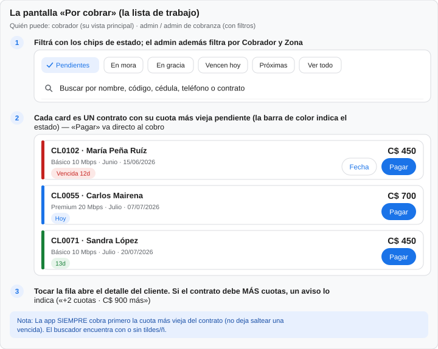

Es la pantalla de trabajo diaria: una card por contrato mostrando su cuota más vieja pendiente, con la barra de color y el badge indicando el estado (rojo mora, ámbar gracia, azul vence hoy, verde próxima). Los chips de arriba filtran por estado; el admin suma filtros por cobrador y zona, y el chip «Ver todo». «Pagar» va directo al cobro de esa cuota; tocar la card abre el detalle del cliente. Si el contrato debe más de una cuota, un aviso rojo lo señala.

### Cobrar una cuota (el flujo del día a día)

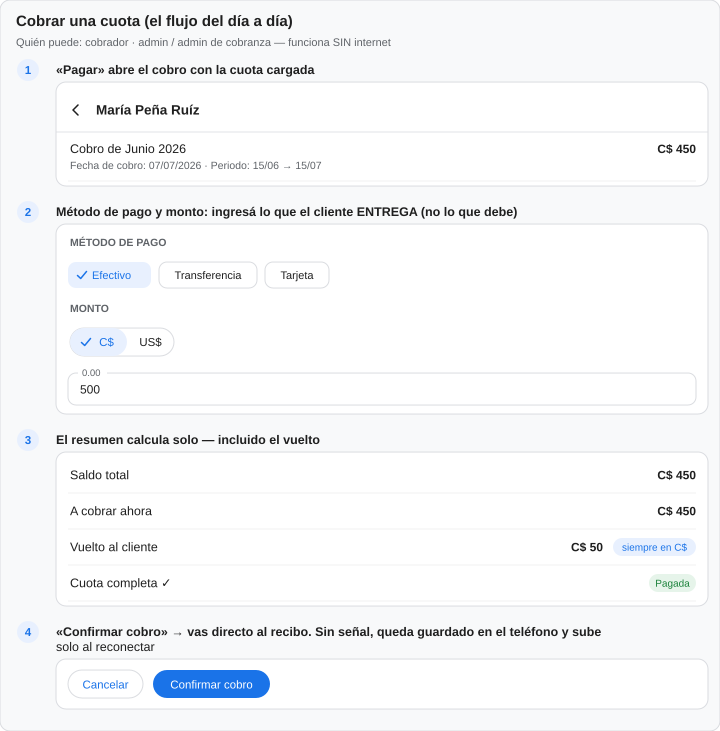

El cobro en 4 movimientos: elegís el método, escribís lo que el cliente ENTREGA (no lo que debe — la app resta sola), y el resumen te muestra el saldo, lo que se aplica y el vuelto al instante. «Confirmar cobro» graba todo y te lleva al recibo. Funciona 100% sin internet: el cobro queda en el teléfono y sube solo cuando vuelve la señal — el recibo también se imprime offline.

### Pago parcial y pago adelantado

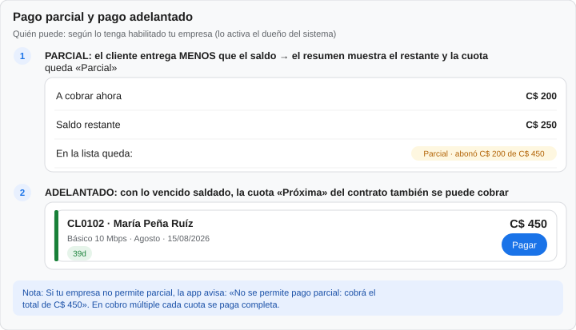

Dos comportamientos que dependen de la configuración de tu empresa: el **parcial** (el cliente entrega menos que el saldo; la cuota queda marcada «Parcial · abonó X de Y» y el resto sigue pendiente) y el **adelantado** (con lo vencido al día, la cuota próxima del contrato también aparece cobrable — siempre en orden, sin saltear). Si están apagados, la app lo explica al intentar.

### Cobrar deuda de contratos suspendidos o cancelados («fuera de ruta»)

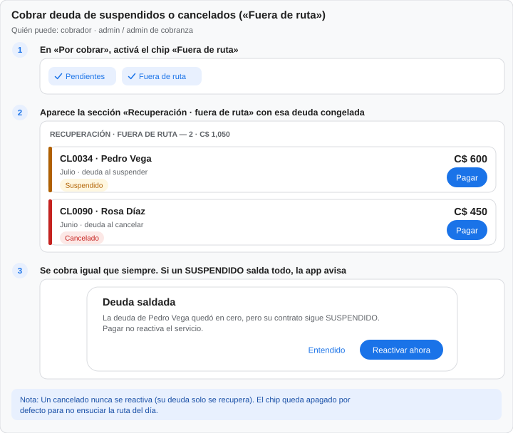

La deuda de contratos suspendidos y cancelados no desaparece: vive en la sección «Recuperación · fuera de ruta», apagada por defecto para no ensuciar la ruta del día. Activá el chip y cobrala como cualquier cuota. Si un suspendido queda en cero, la app avisa «Deuda saldada» con el botón de reactivar (decisión del admin); un cancelado solo se recupera, nunca se reactiva.

### Anular una cuota cobrada por error y volver a cobrarla

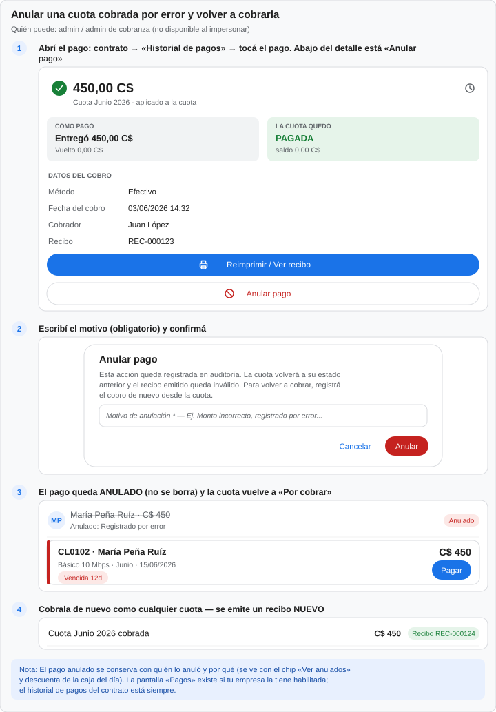

El caso clásico de soporte: se cobró una cuota por error (monto equivocado, cliente equivocado) y hay que corregirla. Abrís el detalle del pago — tal cual se ve en el paso 1 — y abajo está «Anular pago»: exige motivo, deja el pago ANULADO (nunca se borra: queda con quién lo anuló, visible con «Ver anulados», y descuenta de la caja del día), invalida el recibo y devuelve la cuota a «Por cobrar». Ahí la cobrás de nuevo con los datos correctos y sale un recibo nuevo.

**Preguntas frecuentes:**
- **¿Por qué no me deja cobrar la cuota de este mes?** Porque hay una más
  vieja pendiente del mismo contrato: la app cobra siempre en orden.
- **¿Sirve sin internet?** Sí — el cobro queda guardado en el teléfono y sube
  solo al recuperar señal. El recibo también se imprime offline.
- **Anulé un pago pero el cliente pagó bien, solo estaba mal el monto:**
  exacto — ese es el flujo: anular con motivo y cobrar de nuevo con el monto
  correcto. Quedan los dos registros (el anulado y el bueno).

---

# Módulo: Pagos y recibos

**Qué es:** el acto de cobrar (monto, moneda, método, vuelto) y su comprobante.
El vuelto se calcula solo; el recibo se imprime en la térmica (Bluetooth en el
celular, USB en la computadora — sin internet) o se exporta a PDF.

**Qué se puede hacer:**

| Acción | Quién | Dónde |
|---|---|---|
| Cobrar (NIO/USD, método, foto) | todos | Pantalla de cobro |
| Imprimir / PDF / reimprimir recibo | quien cobra | Recibo · pago → recibo |
| Elegir y calibrar la impresora | cada uno en su equipo | Perfil → Impresora térmica |
| Editar un pago | admin, admin de cobranza | Pantalla Pagos (si está habilitada) |
| Anular un pago | admin, admin de cobranza | Pantalla Pagos / contrato → Pagos ([flujo completo](#anular-una-cuota-cobrada-por-error-y-volver-a-cobrarla)) |

### Cobrar en dólares (USD)

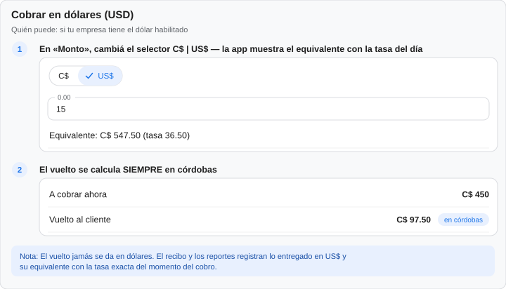

Con el dólar habilitado, el selector C$/US$ del monto convierte con la tasa del día configurada — la app muestra el equivalente en córdobas al escribir. La regla de oro: el vuelto SIEMPRE se devuelve en córdobas, nunca en dólares. En el recibo y los reportes queda lo entregado en US$ y su equivalente con la tasa exacta de ese momento (aunque después la cambies).

### Métodos de pago, referencia y foto de comprobante

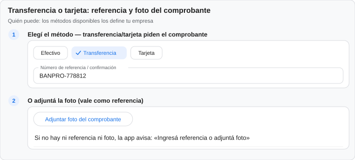

Además del efectivo, tu empresa puede aceptar transferencia y tarjeta. Esos métodos piden respaldo: el número de referencia de la operación o una foto del comprobante (cámara o galería) — con uno de los dos alcanza. La referencia y la foto quedan guardadas con el pago y visibles en su detalle.

### Editar un pago ya registrado

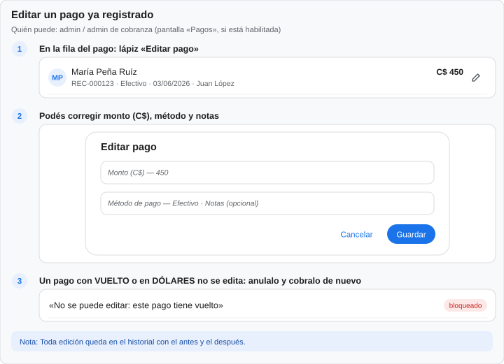

Desde la pantalla «Pagos», el lápiz corrige método, referencia y notas de un pago ya registrado; el monto solo si fue en córdobas y sin vuelto. Los pagos con vuelto, agrupados o en dólares no se editan (descuadrarían la caja): para esos el camino es anular y cobrar de nuevo. Toda edición queda en el historial con el antes y el después.

### El recibo: imprimir, PDF y reimprimir

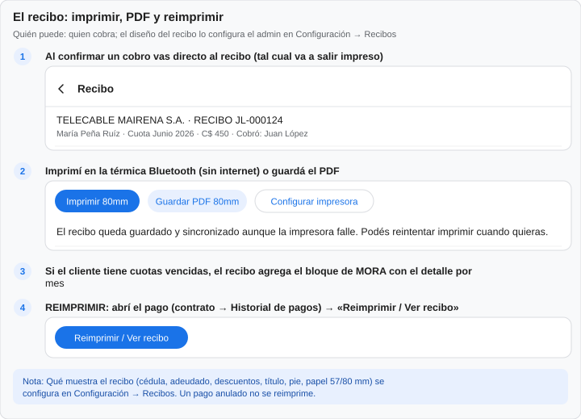

Tras confirmar el cobro ves el recibo exactamente como va a salir. «Imprimir» lo manda a la térmica (57 u 80 mm, sin internet): en el celular a la Bluetooth, en la computadora a la que esté conectada por USB o red. «Guardar PDF» te deja elegir dónde guardarlo, también offline. Si el cliente debe cuotas viejas, el recibo agrega el bloque de mora con el detalle por mes — útil para que firme sabiendo lo que debe. Para reimprimir después: abrí el pago y tocá «Reimprimir / Ver recibo». El diseño completo del recibo se arma en Configuración → Recibos.

### Configurar la impresora de la computadora (USB)

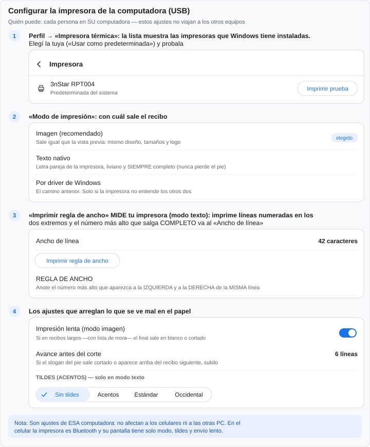

En **Perfil → «Impresora térmica»** elegís de la lista la impresora que Windows tiene instalada («Usar como predeterminada») y la probás con «Imprimir prueba». Debajo está el **Modo de impresión**, que decide con qué sale el recibo: **Imagen** (recomendado) lo imprime igual que la vista previa — mismo diseño, tamaños y logo; **Texto nativo** usa la letra de la impresora: más liviano, sin los tamaños del diseñador, y **nunca pierde el final** aunque el recibo sea largo; **Por driver de Windows** es el camino anterior, solo para impresoras que no entienden los otros dos.

Cada impresora imprime un poco distinto, así que los ajustes de abajo son para dejar el papel como tiene que salir. Todos son **de esa computadora**: no le cambian nada a los celulares ni a las otras PC.

| Si te pasa esto… | Tocá esto |
|---|---|
| El texto sale cortado por la derecha (modo texto) | **«Imprimir regla de ancho»**: imprime líneas numeradas en los dos extremos; anotá el número más alto que salga COMPLETO (con su número a la izquierda Y a la derecha de la misma línea) y cargalo en **«Ancho de línea»** |
| En recibos largos (con lista de mora) el final sale en blanco o cortado | **«Impresión lenta»** (modo imagen): manda el recibo en partes, un poco más lento pero completo |
| Se pierde el slogan del pie, o aparece arriba del recibo siguiente | Subí **«Avance antes del corte»**: empuja el papel unas líneas más antes de que corte la cuchilla |
| Las tildes y la ñ salen como símbolos raros (modo texto) | El selector **«Tildes»**. En la PC viene en *Sin tildes* (escribe «Periodo», «Peña»→«Pena»: feo pero nunca falla). Si querés los acentos de verdad, probá *Acentos* y, si tampoco, *Estándar* u *Occidental* — imprimí una prueba con cada uno y quedate con el que se lea bien |
| La letra se ve apagada o los trazos se pegan | **«Grosor del texto»** (modo imagen). Si aun al máximo sale gris, probá **«Forzar densidad del cabezal»** |
| El recibo empieza muy pegado al borde | En **Imagen** el margen ya viene puesto: si igual sale pegado, es que estás con una versión vieja. En **Texto nativo** el margen sale de **«Ancho de línea»** — si lo bajaste mucho, se come la sangría. *(El slider «Margen izquierdo» hoy solo cambia la hoja de **prueba**, no el recibo.)* |

**Preguntas frecuentes:**
- **¿Quién queda como “el que cobró”?** El usuario que registró el pago — eso
  alimenta el arqueo y los reportes por cobrador. Reasignar el cliente a otro
  cobrador nunca cambia el historial de cobros.
- **¿Puedo dar vuelto en dólares?** No: el vuelto es siempre en córdobas.
- **Configuré la impresora y en la otra PC sigue mal:** son ajustes por equipo.
  Repetilos en cada computadora (el diseño del recibo, en cambio, es de toda
  la empresa y se hace una sola vez en Configuración → Recibos).
- **No veo «Impresión lenta» / no veo la regla de ancho:** dependen del modo —
  «Impresión lenta» y «Grosor del texto» aparecen en **Imagen**; la regla,
  «Ancho de línea» y las tildes, en **Texto nativo**.

---

# Módulo: Mora

**Qué es:** el ciclo automático de las cuotas vencidas. El sistema marca la
mora cada medianoche (hora Nicaragua) después de los días de gracia de tu
empresa.

### Cómo funciona la mora (gracia → vencida)

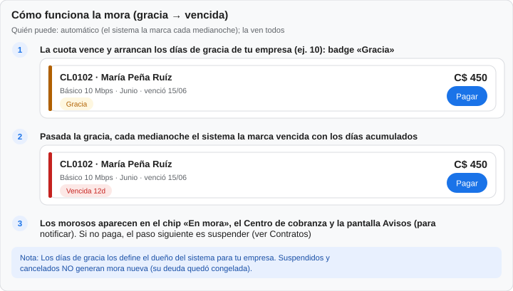

La mora es automática: al vencer la cuota corren los días de gracia de tu empresa (badge ámbar «Gracia»); agotados, el sistema la marca vencida cada medianoche y el badge rojo cuenta los días («Vencida 12d»). Los morosos alimentan el chip «En mora», las métricas del Centro y la pantalla Avisos. La cadena típica: avisar por WhatsApp → orden de corte → suspender el contrato.

**Preguntas frecuentes:**
- **¿Por qué una cuota vencida no aparece en mora todavía?** Está en los días
  de gracia, o el corte de medianoche aún no pasó.
- **¿Qué sigue después de la mora?** Notificar (pantalla Avisos) y, si no paga,
  [suspender el contrato](#suspender-un-contrato).

---

# Módulo: Cargos y descuentos

**Qué es:** ajustes al monto a cobrar de UNA cuota: sumar cargos (reconexión u
otro) o restar descuentos (corrección o promo), siempre con motivo. Cambian el
saldo de esa cuota, no el precio del contrato.

### Agregar un cargo a una cuota (reconexión u otro)

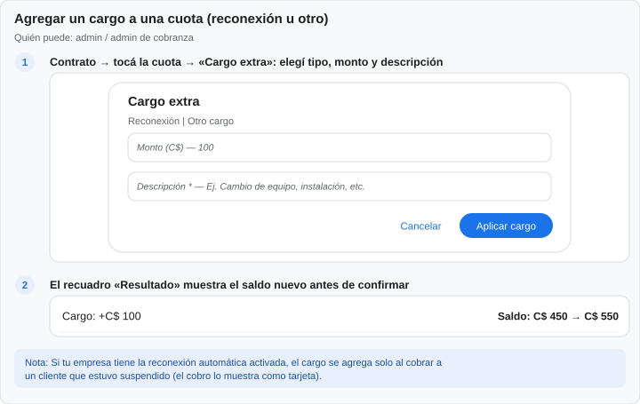

Un cargo suma plata a UNA cuota puntual: reconexión (con su monto por defecto configurado) u otro concepto con descripción obligatoria. El recuadro «Resultado» te muestra el saldo nuevo antes de aplicar. El cargo cuenta para lo recaudado pero no altera el precio del contrato, y si tu empresa tiene la reconexión automática, ese cargo se agrega solo al cobrar a un ex-suspendido.

### Aplicar un descuento a una cuota (y quitarlo)

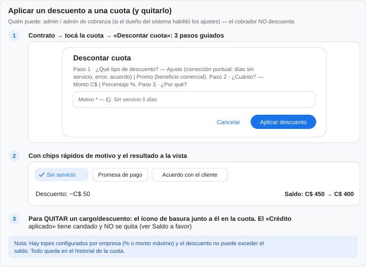

El descuento baja el saldo de UNA cuota en 3 pasos guiados: tipo (Ajuste = corrección por días sin servicio o error; Promo = beneficio comercial — quedan etiquetados distinto en los reportes), cuánto (monto fijo o porcentaje, con los topes que fijó el dueño del sistema) y por qué (motivo obligatorio, con chips de motivos frecuentes). Se quita con el ícono de basura de la cuota — excepto el «Crédito aplicado», que tiene candado porque es plata del cliente.

**Preguntas frecuentes:**
- **¿El cobrador puede hacer descuentos?** No — solo admin/admin de cobranza,
  y solo si la empresa tiene los ajustes habilitados (con topes).
- **¿Por qué un “Crédito aplicado” tiene candado?** Porque es la plata a favor
  del cliente ([ver Saldo a favor](#módulo-saldo-a-favor-crédito)) — borrarlo
  le quitaría su crédito.

---

# Módulo: Saldo a favor (crédito)

**Qué es:** la plata que un cliente pagó de más (típicamente al suspender o
cancelar con meses ya pagados). No es un pago: es un crédito que después se
aplica como descuento en cuotas nuevas — la plata ya había entrado a caja.

### El cliente pagó de más: decidir qué hacer con el excedente

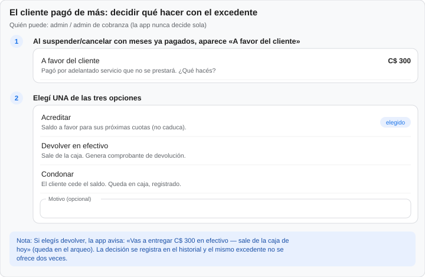

Cuando suspendés o cancelás a alguien que pagó meses por adelantado, esa plata sobrante es del cliente y la app te obliga a decidir: **Acreditar** (queda como saldo a favor para sus próximas cuotas, no caduca), **Devolver en efectivo** (sale de la caja de hoy y queda en el arqueo con comprobante) o **Condonar** (el cliente lo cede y queda en caja, registrado). La decisión va al historial y el mismo excedente nunca se ofrece dos veces.

### Usar el crédito a favor en una cuota

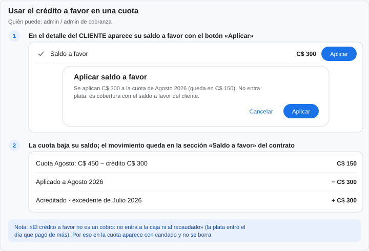

El saldo a favor acreditado aparece en el detalle del cliente con el botón «Aplicar»: se descuenta de su cuota pendiente más vieja como un descuento con candado. Clave contable: el crédito NO es un cobro — no entra a la caja ni al arqueo del día (la plata ya entró cuando pagó de más); por eso el movimiento se ve en la sección «Saldo a favor» del contrato y no en el historial de pagos.

**Preguntas frecuentes:**
- **¿Por qué el crédito no aparece en el arqueo del día?** Porque no entró
  plata nueva: la plata entró el día que el cliente pagó de más. Aplicar el
  crédito solo descuenta su cuota.
- **La devolución en efectivo sí toca caja:** sale plata y queda registrada en
  el arqueo con quién la devolvió y cuándo.

---

# Módulo: Personal (cobradores y roles)

**Qué es:** la gestión de los empleados que usan la app — invitarlos, definir
su rol y prefijo de recibo, desactivarlos y recuperar contraseñas. **Es la
única pantalla donde se dan de alta usuarios** (no hay registro público).

**Qué se puede hacer:**

| Acción | Quién | Dónde |
|---|---|---|
| Invitar miembro (con rol y prefijo) | solo admin | Cobradores → Invitar nuevo |
| Editar / desactivar / permiso de fecha | solo admin | Tocar el miembro |
| Forzar contraseña nueva | solo admin (nunca sobre sí mismo) | Editar miembro |
| Cambiar el ROL de alguien existente | solo el dueño del sistema | — |
| Ver historial de cambios del miembro | solo admin | Detalle → ícono reloj |

### Invitar a un miembro nuevo (cobrador, admin, técnico)

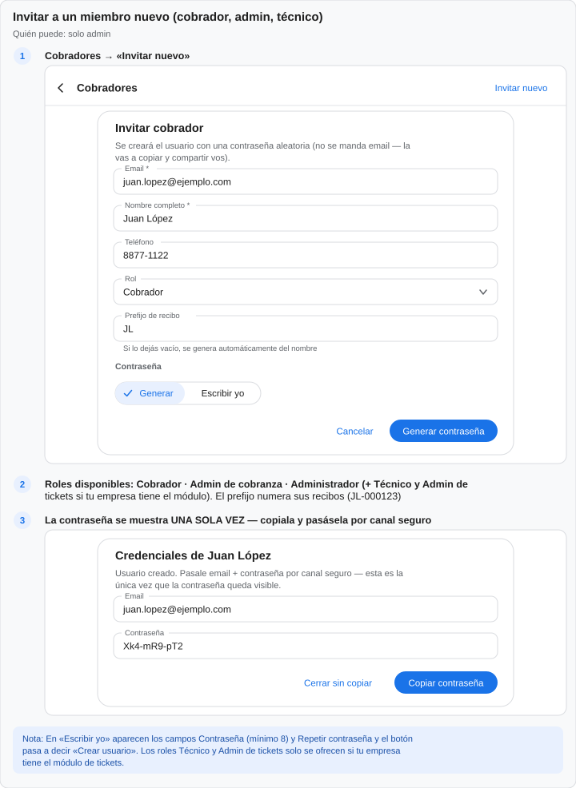

«Invitar nuevo» crea el usuario en el momento — sin emails de por medio: la app genera una contraseña aleatoria y te la muestra UNA sola vez para que se la pases por WhatsApp. Elegís el rol y el prefijo de recibo, que numera todos los recibos de esa persona (JL-000123) — si lo dejás vacío se genera solo con las letras del nombre.

### Editar un miembro, forzarle contraseña o desactivarlo

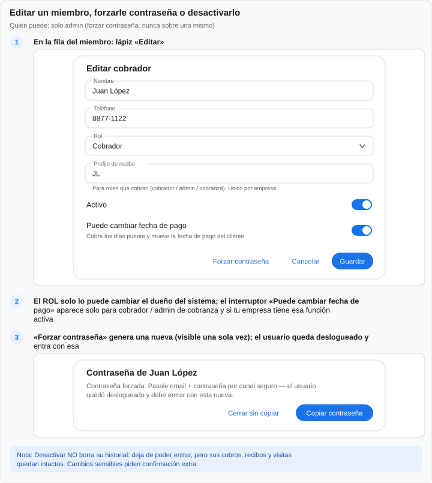

Tocando un miembro editás su nombre, teléfono y prefijo; el ROL solo lo cambia el dueño del sistema. Los dos interruptores importantes: «Activo» (apagarlo = no entra más, pero su historial de cobros queda intacto) y «Puede cambiar fecha de pago» (permiso para que ese cobrador mueva fechas cobrando el puente). «Forzar contraseña» resuelve el clásico “se me olvidó”: genera una nueva, visible una vez, y desloguea al usuario.

### Leer la lista del personal

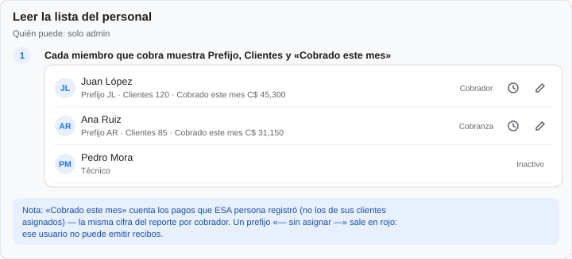

La lista es también un mini-reporte: por cada miembro que cobra ves su prefijo, cuántos clientes tiene asignados y cuánto cobró este mes (los pagos que ÉL registró — la misma cifra del reporte por cobrador). Un prefijo «— sin asignar —» aparece en rojo porque esa persona no puede emitir recibos hasta tenerlo.

**Preguntas frecuentes:**
- **¿Por qué no hay email de recuperación?** El onboarding es sin email: la
  contraseña la genera el sistema y se comparte por WhatsApp. Si se pierde,
  el admin fuerza una nueva.
- **¿Desactivar borra sus cobros?** No — deja de poder entrar, pero todo su
  historial (pagos, recibos, visitas) queda intacto.

---

# Módulo: Visitas

**Qué es:** el registro de la gestión de campo cuando NO hubo cobro («fui y no
estaba», «prometió pagar»). Complementa los pagos para demostrar la gestión.

### Registrar una visita sin cobro

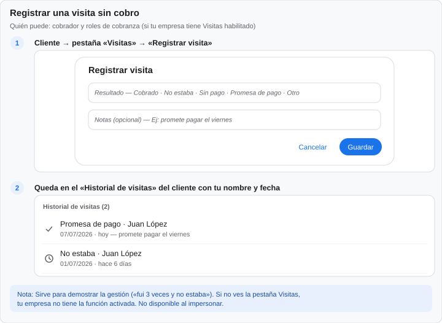

Cuando el cobrador va y no logra cobrar, la visita deja constancia: elige el resultado (No estaba, Promesa de pago…), agrega una nota y guarda. Queda en el «Historial de visitas» del cliente con nombre, fecha y hora — la próxima vez que alguien abra ese cliente entiende la gestión previa. Se registra con la identidad real de quien visita, por eso no está disponible al impersonar.

**Preguntas frecuentes:**
- **¿Dónde se ven las visitas?** En la pestaña Visitas del cliente y en su
  historial de cambios.
- **¿Por qué no puedo registrar una visita?** O tu empresa no tiene la función
  activada, o estás entrando como dueño del sistema (la visita se atribuye a
  quien la registra, por eso se exige la identidad real).

---

# Módulo: Mapa y rutas

**Qué es:** los clientes geolocalizados con un pin coloreado por su estado de
cobranza. La herramienta del cobrador para armar la ruta del día — funciona
sin internet en las zonas ya visitadas.

**Qué se puede hacer:**

| Acción | Quién | Dónde |
|---|---|---|
| Ver pins por estado + filtrar | todos | Mapa (chips de estado) |
| Llamar / ruta / abrir el cliente | todos | Tocar un pin |
| Trazar ruta con distancia y tiempo (offline) | todos | Pin → Ruta |
| Filtros por cobrador / zona / nodo + Ver todo | admin, admin de cobranza | Mapa (modo admin) |
| Capa satélite / calle | todos | Toggle del mapa |

### Planificar el día con el mapa

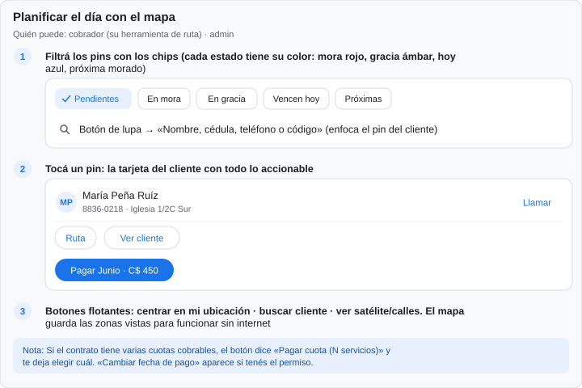

El mapa es la ruta del día en una pantalla: cada cliente es un pin coloreado por su estado de cobranza (los colores son los mismos badges de «Por cobrar» y los define tu empresa en Configuración). Filtrás con los chips, buscás un cliente para enfocarlo, y al tocar un pin tenés todo: llamar, trazar la ruta, abrir la ficha o cobrar directo. Las zonas ya vistas quedan guardadas para funcionar sin internet.

### Trazar la ruta hasta un cliente

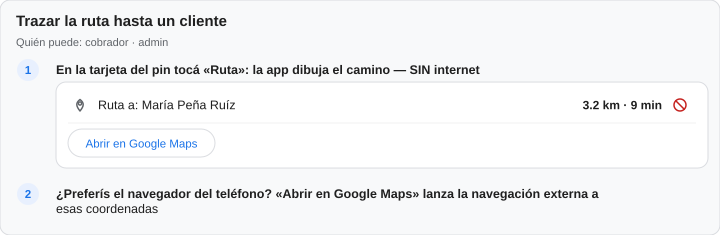

«Ruta» calcula el camino desde tu ubicación hasta el cliente SIN internet (el cálculo es local) y muestra distancia y tiempo estimado. Si preferís tu navegador de siempre, «Abrir en Google Maps» lanza la navegación externa a las mismas coordenadas.

### El mapa del admin (supervisión)

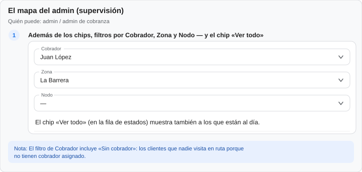

En modo admin el mapa se vuelve herramienta de supervisión: filtros múltiples por cobrador (incluye «Sin cobrador» — los que nadie visita), zona y nodo de red, más el chip «Ver todo» para ver también a los que están al día. Ideal para detectar zonas descuidadas o mora concentrada en una ruta.

**Preguntas frecuentes:**
- **Un cliente no aparece en el mapa:** no tiene GPS cargado en su ficha —
  editalo y capturá la ubicación estando en el lugar.
- **¿El técnico ve la cobranza en el mapa?** No: ve los pins para llegar, pero
  sin deudas ni botones de cobro.

---

# Módulo: Geografía

**Qué es:** el catálogo de zonas de tu empresa (departamento → municipio →
comunidad). Se usa para ubicar clientes y filtrar por zona en mapa y reportes.

### Armar el catálogo geográfico (departamento → municipio → comunidad)

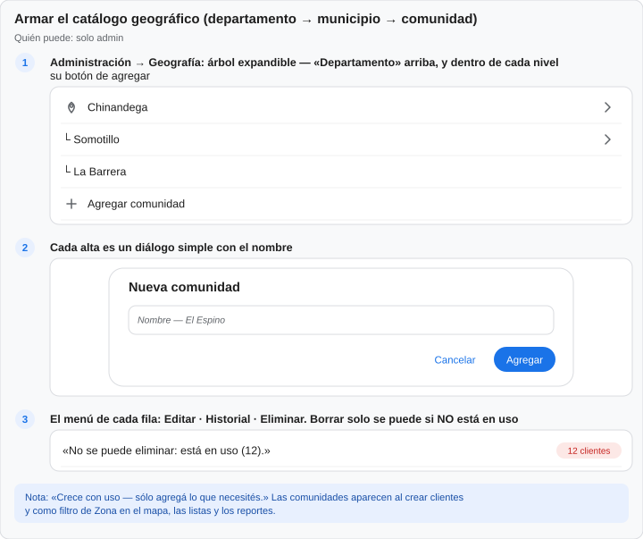

El catálogo geográfico es un árbol de tres niveles que crece con el uso: creás el departamento, adentro sus municipios y adentro las comunidades. Esas comunidades aparecen al ubicar clientes y como filtro de «Zona» en listas, mapa y reportes. Cada fila tiene su menú (Editar · Historial · Eliminar) y el borrado se bloquea si el nivel tiene hijos o clientes: «No se puede eliminar: está en uso (N)».

---

# Módulo: Planes

**Qué es:** el catálogo de planes de servicio (nombre, tipo, precio mensual).
Es la base de la facturación: el contrato toma su precio de acá.

### Planes de servicio: crear, editar precio y desactivar

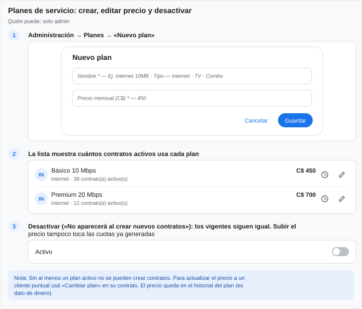

Los planes son la base de la facturación: nombre, tipo (Internet/TV/Combo) y precio mensual. La lista te dice cuántos contratos activos usa cada uno. Dos reglas para no sorprenderse: subir el precio NO toca las cuotas ya generadas (solo contratos nuevos — para un cliente puntual usá «Cambiar plan» en su contrato), y desactivar un plan solo lo saca de los contratos nuevos, los vigentes siguen.

**Preguntas frecuentes:**
- **Subí el precio del plan, ¿por qué el cliente sigue pagando lo viejo?**
  Las cuotas ya generadas conservan su precio. El precio nuevo aplica a
  contratos nuevos, o usá [«Cambiar plan»](#cambiar-el-plan-de-un-contrato-vigente)
  en el contrato del cliente para actualizarlo.

---

# Módulo: Centro de cobranza

**Qué es:** el tablero del día del admin. Junta en una pantalla lo accionable
de HOY (vence hoy, mora, cortes por suspender, créditos sin aplicar) y te lleva
a la pantalla donde se actúa. **El Centro no toca dinero por sí solo.**

### El Centro de cobranza: qué atiendo hoy

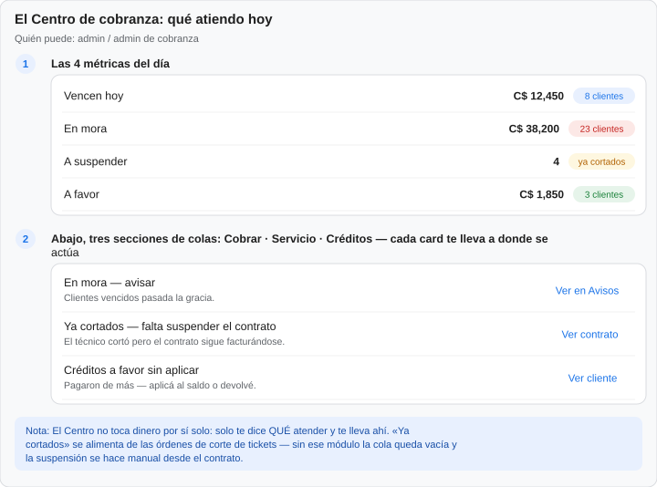

El Centro es el tablero de la mañana: cuatro métricas (cuánto vence hoy, cuánta mora acumulada, cuántos cortes ejecutados faltan suspender y qué créditos siguen sin aplicar) y abajo las colas agrupadas en Cobrar · Servicio · Créditos. Cada card te lleva a la pantalla donde se actúa — el Centro nunca toca dinero solo, es el índice del día.

Cada fila de la cola de Servicio te lleva al contrato y ahí suspendés o reactivás de a uno, con la deuda que va a quedar cobrable a la vista. **No hay una acción para cortar varios de una vez**: cada suspensión es una decisión individual sobre el servicio de una persona, y quien tiene que aprobarla necesita verla sola.

---

# Módulo: Avisos y WhatsApp

**Qué es:** la pantalla para recordarles el pago a los clientes en gracia o en
mora, por WhatsApp con mensaje prellenado. Manual y gratis.

### Avisar por WhatsApp a los clientes en gracia o mora

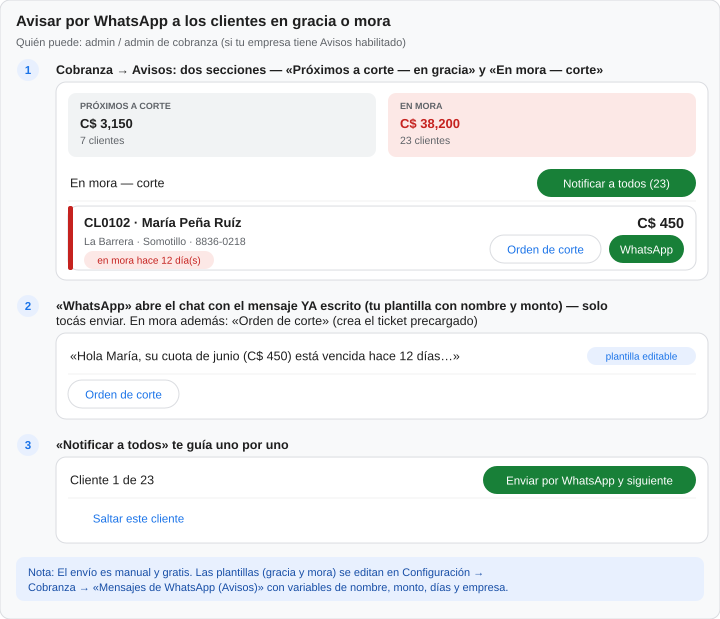

Avisos es la pantalla de cobranza preventiva: los que están por caer en corte (gracia) y los que ya cayeron (mora), cada uno con su card de color. «WhatsApp» abre el chat del cliente con el mensaje YA armado desde tu plantilla — solo tocás enviar; es manual y gratis. «Notificar a todos» te lleva de la mano cliente por cliente, y en mora aparece además «Orden de corte» para mandar al técnico.

**Preguntas frecuentes:**
- **¿Puedo cambiar el texto del mensaje?** Sí — la plantilla se edita en
  Configuración (con variables como el nombre y el monto).
- **¿Se puede mandar automático?** El envío automático existe en el sistema
  pero está desactivado; hoy el envío es manual, cliente por cliente.

---

# Módulo: Reportes, arqueo y dashboard

**Qué es:** la foto del negocio. El **Resumen** muestra KPIs del mes en vivo;
**Reportes** exporta PDF/Excel (cobranza, arqueo, por cobrador, fiscal, mora…)
para cuadrar caja y rendir cuentas.

**Qué se puede hacer:**

| Acción | Quién | Dónde |
|---|---|---|
| Ver KPIs del mes en vivo | admin, admin de cobranza | Resumen (dashboard) |
| Generar reportes (rango + cobradores) | admin, admin de cobranza | Reportes |
| Reporte de cobranza estándar (Excel) | admin, admin de cobranza | Reportes → Generar |
| Reportes detallados (arqueo, fiscal…) | si tu empresa los tiene activados | Reportes → Generar |

### El Resumen (dashboard): la foto del mes en vivo

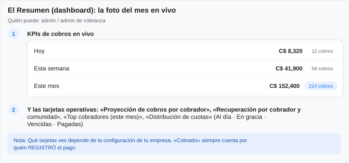

El Resumen abre con lo cobrado Hoy / Esta semana / Este mes (en vivo, contando por quién registró el pago) y sigue con las tarjetas analíticas: proyección de cobros por cobrador, recuperación de mora por zona, top cobradores y la distribución de cuotas. Qué tarjetas ves lo define el dueño del sistema para tu empresa.

### Generar y descargar un reporte

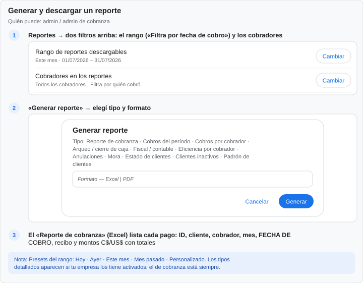

Todo reporte sale de la misma pantalla: primero fijás el rango (filtra por FECHA DE COBRO — presets Hoy, Ayer, Este mes, Mes pasado o personalizado) y qué cobradores entran; después «Generar reporte» y elegís el tipo y el formato (Excel o PDF). El «Reporte de cobranza» es la plantilla estándar en Excel con cada pago del período; los otros 10 tipos (arqueo, fiscal, mora, padrón…) aparecen si tu empresa tiene los reportes detallados activados.

### Cuadrar la caja con el arqueo

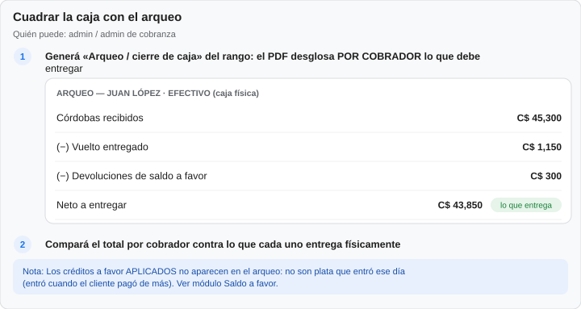

El arqueo cierra la caja: el bruto de todos los cobros del rango menos las devoluciones de saldo a favor = el neto que debe haber físicamente, desglosado por cobrador y método. Si un número no te cuadra contra el dashboard, revisá el rango y las devoluciones del período — y recordá que los créditos aplicados nunca aparecen acá (no son plata que entró ese día).

**Preguntas frecuentes:**
- **El arqueo no coincide con lo del dashboard:** revisá el rango de fechas y
  las devoluciones de saldo a favor del período — el dashboard muestra el
  bruto del período; el arqueo cierra el neto (bruto − devoluciones).
- **¿Por qué un cobro le figura a Juan si el cliente es de Ana?** Porque lo
  registró Juan: los reportes cuentan por quién COBRÓ, no por el cobrador
  asignado.

---

# Módulo: Red (nodo → hub → puerto)

**Qué es:** la topología física de tu red en tres niveles. Cada cliente se
conecta a un puerto, y eso te dice de un vistazo quiénes quedan afectados si
se cae un nodo, y dónde está conectado cada cliente.

### Armar la topología de red y conectar a los clientes

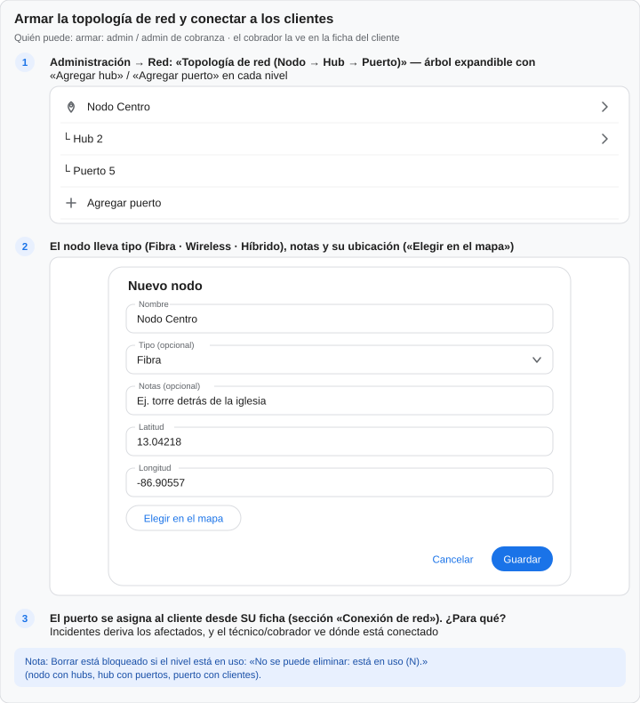

La topología es el esqueleto físico de tu red en tres niveles: el nodo (con tipo fibra/wireless/híbrido y su ubicación en el mapa), sus hubs y los puertos de cada hub. El puerto se conecta al cliente desde la ficha del cliente. ¿El valor? Sabés al toque a quién afecta la caída de un nodo, y dónde está conectado cada cliente. El borrado se bloquea en cadena si el nivel está en uso.

---

# Módulo: Configuración

**Qué es:** el panel donde el admin define la identidad de la empresa, las
reglas de cobranza, los métodos de pago y el diseño del recibo. **Cada cambio
se sincroniza a todos los dispositivos del equipo y queda en el historial.**

**Mapa rápido — qué ajuste afecta a qué:**

| Pestaña | Ajuste | Afecta a |
|---|---|---|
| Empresa | Nombre comercial, dirección, teléfono, RUC, WhatsApp, logo | Recibos (térmica y PDF) · Reportes exportados |
| Cobranza | Días de gracia | Cuándo una cuota pasa a MORA: badges, Avisos, Centro, reportes de mora |
| Cobranza | Días de cuotas próximas | Con cuánta anticipación aparece la cuota en «Por cobrar» y el mapa |
| Cobranza | Cobrador puede editar fecha | Habilita «Cambiar fecha de pago» al cobrador (mapa y contrato de SUS clientes) |
| Cobranza | Admin cobranza ve historial de cambios | Si ese rol ve el ícono del reloj (historial) |
| Cobranza | Colores de estados de cuota | Los colores de los pins del mapa y los badges (mora, gracia, hoy, próxima) |
| Cobranza | Mensajes de WhatsApp (Avisos) | El texto prellenado del botón WhatsApp en Avisos (variables: nombre, monto, días, empresa) |
| Pagos | Aceptar transferencia / Aceptar tarjeta | Qué métodos aparecen en la pantalla de cobro (el efectivo es fijo) |
| Pagos | Aceptar pagos en USD + Tasa USD → C$ | El cobro en dólares, su equivalente en el recibo y los reportes |
| Recibos | Diseñador del recibo (papel 58/80 mm, título, pie, bloques, cédula, saldo, descuentos) | Todos los recibos que se emitan desde ese momento |

### Configuración → Empresa (identidad del ISP)

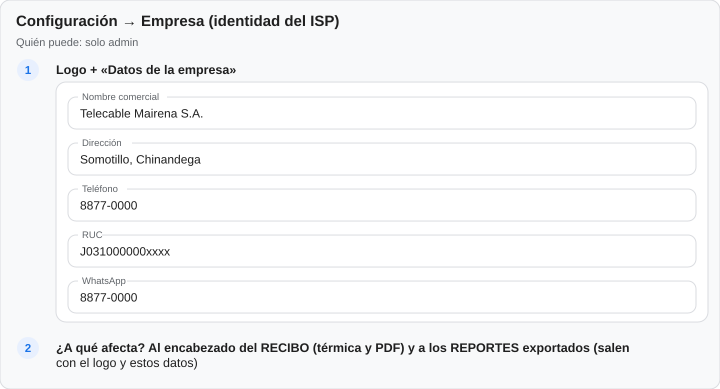

La pestaña Empresa es tu identidad: nombre comercial, dirección, teléfono, RUC, WhatsApp y el logo. Estos datos no son decorativos — son el encabezado de cada recibo que imprimís (térmica y PDF) y la portada de los reportes exportados.

### Configuración → Cobranza (reglas y permisos)

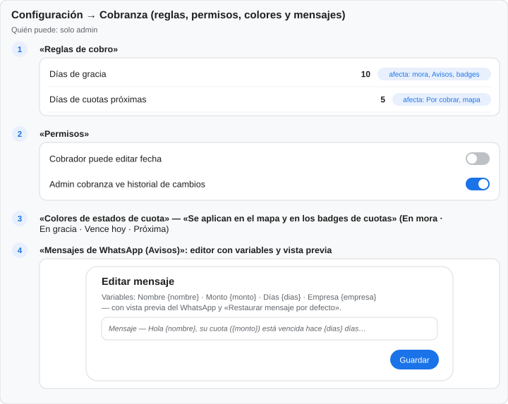

La pestaña Cobranza gobierna el reloj del negocio: los «Días de gracia» definen cuándo una cuota vencida pasa a MORA (mueve badges, Avisos, Centro y reportes) y los «Días de cuotas próximas» cuántos días antes aparece una cuota en «Por cobrar» y el mapa. Abajo, los permisos del rol (si el cobrador puede cambiar fechas; si el admin de cobranza ve el historial), los colores de los estados y el editor de los mensajes de WhatsApp con variables {nombre} {monto} {dias} {empresa} y vista previa.

### Configuración → Pagos (métodos y dólar)

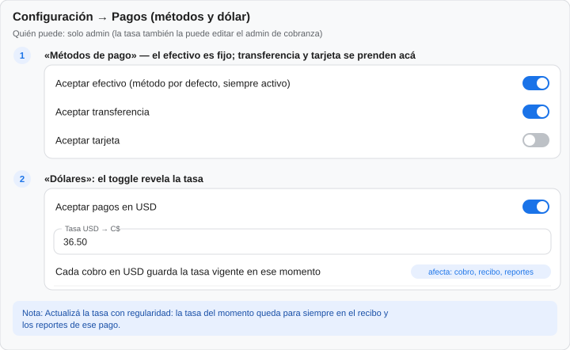

La pestaña Pagos define con qué se puede cobrar: el efectivo es fijo, transferencia y tarjeta se prenden acá (y aparecen o desaparecen de la pantalla de cobro al instante en todos los dispositivos). El bloque «Dólares» habilita el USD y guarda la tasa: cada cobro usa la tasa vigente en su momento y esa queda para siempre en su recibo y reportes — por eso conviene mantenerla al día.

### Configuración → Recibos (el diseñador del comprobante)

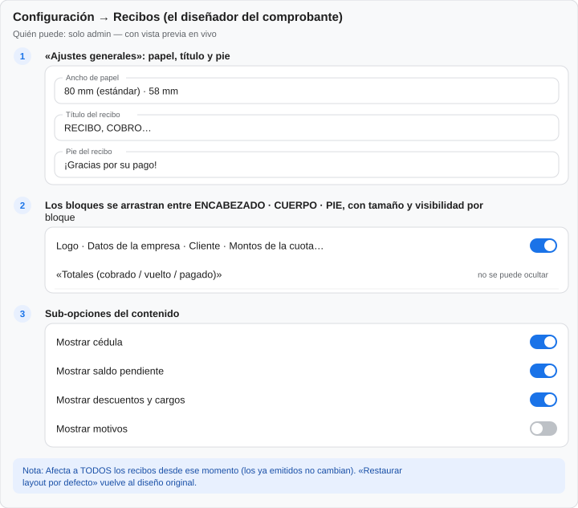

El diseñador de recibos es WYSIWYG: a la izquierda editás, a la derecha ves el recibo en vivo. Definís el papel (80 o 58 mm), título y pie, y arrastrás los bloques entre Encabezado / Cuerpo / Pie con su tamaño y visibilidad (los totales no se pueden ocultar — es un comprobante). Las sub-opciones afinan el contenido: cédula, saldo pendiente, descuentos y sus motivos. Aplica a todos los recibos desde ese momento; los ya emitidos no cambian. Ojo con la diferencia: acá se define QUÉ dice el recibo para toda la empresa; cómo SALE en el papel de cada impresora (que no se corte, las tildes, el ancho real) se ajusta por equipo en [Impresora](#configurar-la-impresora-de-la-computadora-usb).

**Funciones que activa el dueño del sistema (no salen en tu Configuración):**
si necesitás alguna de estas, pedísela — no es que “falte”, está apagada para
tu empresa: pantalla de Avisos y botón WhatsApp · pantalla Pagos (anular/editar)
· «Cobro extra» (multas / cargos sueltos) · descuentos y sus topes · recargo de
reconexión · cambio de plan · pago parcial y adelantado · registro de visitas ·
reportes detallados · secciones del Resumen.

**Preguntas frecuentes:**
- **Cambié un ajuste y el cobrador no lo ve:** dale unos segundos — el cambio
  viaja con la sincronización; sin internet lo recibe al reconectarse.
- **¿Quién puede tocar Configuración?** Solo el admin (el admin de cobranza
  únicamente la tasa del dólar). Todo cambio queda registrado con autor.

---

*Guía generada y mantenida junto con la app. Los mockups viven en `img/` y se
regeneran con `tools/mockups_guia.py` cuando un módulo cambia. Si algo de esta
guía no coincide con tu app, avisá — puede ser una versión vieja.*
